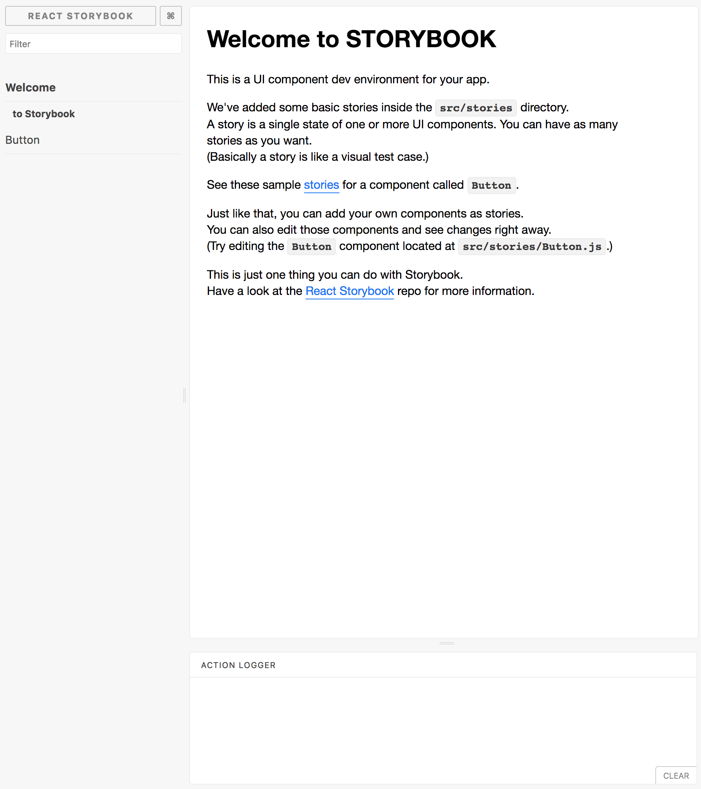

# Chapter 10: Showcasing {#Chapter-10}

In the previous chapter we unlocked some powerful capabilities by offering real-time theme support to our application. Even though we only have a handful of components, it's starting to become complex in understanding the various APIs they provide. This issue becomes increasingly apparent in larger U&I libraries with hundreds of components. How do we, as developers, communicate our component's interfaces to other developers, designers, etc.?

There's a little secret that I've been holding out on the entire book! I'm sorry! It was for your own good!

Doesn't it make sense to build and document your U&I components in complete isolation? I believe so! Not only does this strategy provide the ability to build, review and test in isolation but it also provides the appropriate context to ensure you're building exactly what's needed — nothing more, nothing less. Meet [Storybook](https://storybook.js.org/)!


## What is Storybook?

Storybook, as described on their site, is the "UI Development Environment You'll love  to use." That captures my experience of Storybook. It's a handy tool that provides an environment to build, document and showcase components in isolation. Instead of reading a component's source code to try and figure out the various APIs provided, we can visit Storybook, where you get the component and all of its documentation in one simple and intuitive environment.


## React Storybook in Action

Adding React Storybook to your app is as easy as a few simple commands:

First, you need the global command installed:

{line-numbers=off, lang=text}
```
$ npm i -g getstorybook
```

Then, at the root of our directory, we execute the following command for Storybook to configure our application.

{line-numbers=off, lang=text}
```
$ getstorybook
```

Once this is done, you'll see a `.storybook` directory at the root of your project. The beauty about Storybook, similar to `create-react-app`, is that it works out-of-the-box with some wonderful functionality.

{line-numbers=off, lang=text}
```
$ npm run storybook
```

If you the run the following command, you will see Storybook in action by visit `http://localhost:6006` or whatever address displayed.


{width=60%}



### Documenting <TodosList />

Let's create our first story! In the same spirit of keeping our component files co-located, we will house the story file in the same directory.

{title=src/components/TodosList/TodosList.story.js, lang=text}
```
// dependencies
import React from 'react';
import { storiesOf } from '@kadira/storybook';

// local dependencies
import TodosList from './TodosList';

export default storiesOf('TodosList', module)
.add('default view', () => (
  <TodosList>

  </TodosList>
));
```

We import  `storiesOf` from `storybook` to be able to create a new story. We add a story called `default view` where we don't render anything.

Now, we need to import this story in our storybook configuration file:

{title=.storybook/config.js, lang=text}
```
// dependencies
import { configure } from '@kadira/storybook';

function loadStories() {
  require('../src/components/TodosList/TodosList.story');
}

configure(loadStories, module);
```

If you visit the Storybook UI, you should see an error:

{lang=text}
```
Error: mixins.get is not a function
```

Can you guess why that is?

Our component relies on `mixins` and since we're building our component in isolation without `theme-wrap`, we get that breaking error. Let's see how we can resolve this:

{title=src/components/TodosList/TodosList.story.js, lang=text}
```
// dependencies
import React from 'react';
import { storiesOf } from '@kadira/storybook';
import { Style, StyleRoot } from 'radium';
import normalize from 'radium-normalize';
import { ThemeWrapProvider } from 'theme-wrap';

// local dependencies
import TodosList from './TodosList';
import globalStyles from '../../styles/globals.styles';
import mixins from '../../styles/mixins';
import theme from '../../styles/theme';

export default storiesOf('TodosList', module)
.add('default view', () => (
  <StyleRoot>
    <Style rules={normalize} />
    <Style rules={globalStyles} />
    <ThemeWrapProvider theme={theme}
                       mixins={mixins}>
      <TodosList>

      </TodosList>
    </ThemeWrapProvider>
  </StyleRoot>
));
```

We replicate the same functionality in `App.js` by wrapping our component with all of the necessary dependencies. Go ahead and check out Storybook UI.

It's not very exciting, since we're not displaying any children, so let's document that functionality:

{title=src/components/TodosList/TodosList.story.js, lang=text}
```
// dependencies
...

// local dependencies
...

export default storiesOf('TodosList', module)
.add('default view', () => (
  ...
))

.add('renders children', () => (
  <StyleRoot>
    <Style rules={normalize} />
    <Style rules={globalStyles} />
    <ThemeWrapProvider theme={theme}
                       mixins={mixins}>
      <TodosList>
        {_.map([1, 2, 3], (i) => <li>{i} - Item</li>)}
      </TodosList>
    </ThemeWrapProvider>
  </StyleRoot>
))
```

Visit Storybook UI and you should see a second story, labeled as `renders children`, where it display our component containing 3 `li` elements.

There's a good amount of repeated code! How do we solve this? We can create another component or use Storybook's `decorator`:

{title=src/components/TodosList/TodosList.story.js, lang=text}
```
// dependencies
...
import { addDecorator, storiesOf } from '@kadira/storybook';

// local dependencies
...

const Root = (story) => (
  <StyleRoot>
    <Style rules={normalize} />
    <Style rules={globalStyles} />
    <ThemeWrapProvider theme={theme}
                       mixins={mixins}>
      {story()}
    </ThemeWrapProvider>
  </StyleRoot>
);

addDecorator(Root);

// helper function that generates a set of children
const generateChildren = (num = 5) => _(num)
  .range()
  .map((i) => <li key={i}>{i} - Item</li>)
  .value();

export default storiesOf('TodosList', module)
.add('default view', () => (
  <TodosList>

  </TodosList>
))

.add('renders children', () => (
  <TodosList>
    {generateChildren(5)}
  </TodosList>
))
```

Very nice! We create a `Root` component that gets `story` via `props` and use it to decorate all of our stories with `addDecorator`. Let's continue:

{title=src/components/TodosList/TodosList.story.js, lang=text}
```
// dependencies
...

// local dependencies
...

export default storiesOf('TodosList', module)
.add('default view', () => ...)

.add('renders children', () => (...)

.add('accepts custom styles', () => {
  const customStyles = {
    todosList: {
      background: 'orange',
      border: '10px solid purple',
      color: 'purple',
      fontSize: 40
    }
  };
  return (
    <TodosList pStyles={customStyles}>
      {generateChildren(10)}
    </TodosList>
  );
});
```

We document that `TodosList` accepts custom styles, which can be seen in Storybook UI.

This is great but how would others know how to use this components without needing to look at its source code? Storybook provides many useful `addons` for developers! Let's use one that does exactly what we need:

{line-numbers=off, lang=text}
```
$ npm i @storybook/addon-info --save-dev
```

We need to update our configuration file to use this addon:

{title=.storybook/config, lang=text}
```
// dependencies
import { configure, setAddon } from '@kadira/storybook';
import infoAddon from '@storybook/addon-info';

setAddon(infoAddon);

function loadStories() {
  require('../src/components/TodosList/TodosList.story');
}

configure(loadStories, module);
```

Import `infoAddon` and use it with `setAddon`.

T> If you encounter an error that `react-addons-create-fragment` is `undefined`, you can install it with the following command: `npm i react-addons-create-fragment --save`.

If we want component stories to include their API documentation, we need to update the `add` method to `addWithInfo`:

{title=src/components/TodosList/TodosList.story.js, lang=text}
```
// dependencies
...

// local dependencies
...

export default storiesOf('TodosList', module)
.addWithInfo('default view', () => ...)

.addWithInfo('renders children', () => (...)

.addWithInfo('accepts custom styles', () => { ... });
```

Visit Storybook and you should see a little icon, where you can toggle the component's info and interface. There are many other options with this addon, so I recommend experimenting to see what works for you.

Before we move onto our next component, let's refactor our configuration file so that we can `decorate` all of our stories with `theme-wrap` and `radium`:

{title=.storybook/config.js, lang=text}
```
// dependencies
import React from 'react';
import normalize from 'radium-normalize';
import { Style, StyleRoot } from 'radium';
import infoAddon from '@storybook/addon-info';
import { ThemeWrapProvider } from 'theme-wrap';
import { addDecorator, configure, setAddon } from '@kadira/storybook';

// local dependencies
import mixins from '../src/styles/mixins';
import theme from '../src/styles/theme';
import globalStyles from '../src/styles/globals.styles';

const Root = story => (
  <StyleRoot>
    <Style rules={normalize} />
    <Style rules={globalStyles} />
    <ThemeWrapProvider theme={theme}
                       mixins={mixins}>
      {story()}
    </ThemeWrapProvider>
  </StyleRoot>
);

// attach our decorator
addDecorator(Root);

// enable component info
setAddon(infoAddon);

configure(() => {
  require('../src/components/TodosList/TodosList.story');
}, module);
```

Then update `TodosList.story.js`:

{title=src/components/TodosList/TodosList.story.js, lang=text}
```
// dependencies
import _ from 'lodash';
import React from 'react';
import { storiesOf } from '@kadira/storybook';

// local dependencies
import TodosList from './TodosList';

// helper function that generates a set of children
const generateChildren = (num = 5) => _(num)
.range()
.map((i) => <li key={i}>Item #{i}</li>)
.value();

export default storiesOf('TodosList', module)
.addWithInfo('default view', () => (
  <TodosList>
    <li>Default</li>
  </TodosList>
))

.addWithInfo('renders children', () => (
  <TodosList>
    {generateChildren(5)}
  </TodosList>
))

.addWithInfo('accepts custom styles', () => {
  const customStyles = {
    todosList: {
      background: 'orange',
      border: '10px solid purple',
      color: 'purple',
      fontSize: 40
    }
  };
  return (
    <TodosList pStyles={customStyles}>
      {generateChildren(10)}
    </TodosList>
  );
});
```

Visit Storybook UI and everything should work as expected.


### Documenting <TodosListInfo />

Let's create our second story for `TodosListInfo`.

First update the Storybook config file:

{title=.storybook/config.js, lang=text}
```
...

configure(() => {
  require('../src/components/TodosList/TodosList.story');
  require('../src/components/TodosListInfo/TodosListInfo.story');
}, module);
```

We need to require each story to be displayed inside of Storybook UI.

Now, onto our story:

{title=src/components/TodosListInfo/TodosListInfo.story.js, lang=text}
```
// dependencies
import _ from 'lodash';
import React from 'react';
import { storiesOf } from '@kadira/storybook';

// local dependencies
import TodosListInfo from './TodosListInfo';

const generateTodos = (num = 5) => {
  const todos = {};
  _.times(num, id => {
    todos[id] = {
      id,
      completed: Math.random() > 0.5,
      description: `Task #${id}`
    };
  });
  return todos;
};

export default storiesOf('TodosListInfo', module)
.addWithInfo('default view', () => (
  <TodosListInfo todos={generateTodos()} />
));
```

Simple enough! Since we've locked this component's styling to the outside world, it's nearly impossible to style/move it, as seen in the Storybook UI. Feel free to extend this component's functionality, if needed.


### Documenting <TodosListItem /> 

Let's document our last remaining component, `TodosListItem`.

{title=.storybook/config.js, lang=text}
```
...

configure(() => {
  require('../src/components/TodosList/TodosList.story');
  require('../src/components/TodosListInfo/TodosListInfo.story');
  require('../src/components/TodosListItem/TodosListItem.story');
}, module);
```

Onto the fun parts:

{title=src/components/TodosListItem/TodosListItem.story.js, lang=text}
```
// dependencies
import React from 'react';
import { storiesOf } from '@kadira/storybook';

// local dependencies
import TodosListItem from './TodosListItem';

const sampleTodo = {
  id: 1,
  completed: false,
  description: 'Sample Todo'
};

const sampleCompletedTodo = {
  id: 2,
  completed: true,
  description: 'Sample Completed Todo'
};

export default storiesOf('TodosListItem', module)
.addWithInfo('default view', () => (
  <TodosListItem />
))

.addWithInfo('accepts todo via props', () => (
  <TodosListItem todo={sampleTodo} />
))

.addWithInfo('accepts completed todo via props', () => (
  <TodosListItem todo={sampleCompletedTodo} />
))

.addWithInfo('accepts custom styles via props', () => {
  const customStyles = {
    todosListItem: {
      border: '20px dashed orange',
      color: 'orange',
      fontSize: 40,
      margin: '0 auto',
      padding: 10,
      width: 500
    }
  };
  return (
    <TodosListItem todo={sampleTodo}
                   pStyles={customStyles} />
  );
})

.addWithInfo('accepts custom completed styles via props', () => {
  const customStyles = {
    completed: {
      backgroundColor: 'black',
      color: 'orange'
    }
  };
  return (
    <TodosListItem todo={sampleCompletedTodo}
                   pStyles={customStyles} />
  );
});
```

Nothing out of the ordinary! We create a few stories, outlining the various APIs provided by `TodosListItem`. However, we have one functionality that hasn't been documented: `handleClick`. Storybook provides another useful feature, `action`, that helps document our event handlers:

{title=src/components/TodosListItem/TodosListItem.story.js, lang=text}
```
// dependencies
...
import { action, storiesOf } from '@kadira/storybook';

...

.addWithInfo('accepts toggleTodo callback via props', () => (
  <TodosListItem todo={sampleTodo}
                 handleClick={(id) => (e) => action('toggle todo')(id)} />
));
```

Since we opted for higher order functions to handle our event handlers, our event handler for `handleClick` mimics what we originally had in `App.js`. If you now click the item, you'll see a message in the `action logger` section of Storybook UI.


## Summary

In this chapter, we introduced Storybook into our tool chain. You should now have the foundation to be able to experiment with and create other Storybook addons, decorators and configurations. Storybook is both useful and powerful in providing an environment to rapidly create, document and showcase components.

Lastly, we can fulfill the last two U&I criteria that we ignored in previous chapters.

I> Documenting and presenting a U&I library doesn't necessarily rely on any particular styling strategy, so we could've used Storybook all along.


|                                 | CSS | SCSS | CSS Modules | Inline Styles |
|---------------------------------|:---:|:----:|:-----------:|:-------------:|
| **No global namespace**         |  *  |  *   |     ✔       |      ✔       |
|---------------------------------|-----|------|-------------|---------------|
| **Unidirectional styles**       |  ✔  |  ✔  |     ✔       |      ✔       |
|---------------------------------|-----|------|-------------|---------------|
| **Dead code elimination**       |     |      |     ✔       |      ✔       |
|---------------------------------|-----|------|-------------|---------------|
| **Minification**                |     |      |     ✔       |      ✔       |
|---------------------------------|-----|------|-------------|---------------|
| **Shareable constants**         |     |      |             |      ✔        |
|---------------------------------|-----|------|-------------|---------------|
| **Deterministic resolution**    |  *  |  *   |     ✔       |      ✔       |
|---------------------------------|-----|------|-------------|---------------|
| **Isolation**                   |  *  |  *   |     ✔       |      ✔       |
|---------------------------------|-----|------|-------------|---------------|
| **Extendable**                  |  *  |  *   |     ✔       |      ✔       |
|---------------------------------|-----|------|-------------|---------------|
| **Documentable**                | ✔   |  ✔  |     ✔       |      ✔        |
|---------------------------------|-----|------|-------------|---------------|
| **Presentable**                 | ✔  |  ✔   |     ✔       |      ✔        |
|---------------------------------|-----|------|-------------|---------------|

A> [ ✔ Fulfilled ] [ * Pseudo fulfilled ]


Before moving on I recommend creating other components using Storybook and experiment with other add-ons.

In the following chapter, we will cover other promising technologies around the corner.