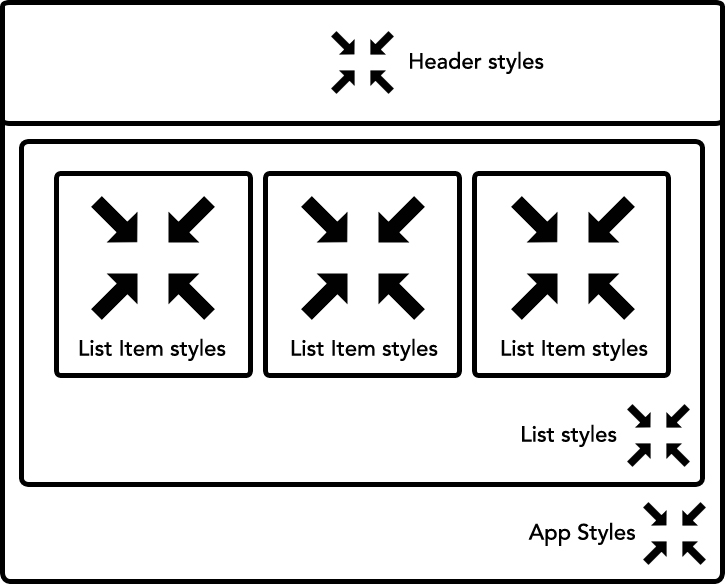

# Chapter 2: What is U&I? {#Chapter-2}

In the previous chapter, we covered a brief history of UI development and were introduced to a few key terms that we'll be covering throughout this book. In this chapter, we'll cover what U&I components are and how to derive them in an axiomatic manner.

**So, what is U&I?**

In short, if we define our *UI components* in terms of modular components that are reusable in a given *application*, then *U&I components* can be understood as UI components that can be used across *applications*.

A> U&I components are UI components that are reusable across applications. 

One of my major motivations for thinking about U&I components was a [talk](https://vimeo.com/116209150) given by [Christopher Chedeau](https://twitter.com/Vjeux), one of React's core contributors, in November 2014 at NationJS. The talk covers many of the downfalls of CSS in UI development and how the Facebook team has been exploring inline styles to mitigate these issues. Even though the talk only talks about CSS, I've found many of the concepts to be great axioms for defining U&I components. Now that you've got a hint for what U&I components are, lets cover them in detail and how to go about building them.

## UI Components

UI Components are modular UI blocks that can be used across an application. Their functionality and reusability differ from application to application, but their overall intent, from my experience, has been scoped to a single organization or application. For example, an application may have a `Header`, `Footer` and `Slider` component that is used throughout the application, however, the scope, modularity, extendibility and scalability of these components has always been understood in a single context --- that is, a single application.

## U&I Components

U&I components are UI components that are intended for several contexts. That is, they are components intended not just for a single application but also for several applications. This may sound simple, but the truth is that building reusable UI components in a single application is challenging enough, so building U&I components for several applications requires even more rigor. A valid concern is whether there is a difference between a U&I library and some of the traditional UI libraries we've seen over the years. There is a subtle difference that will become clearer as we define a sample U&I contract. In short, all U&I libraries are UI libraries but not all UI libraries are U&I libraries.

A> All U&I libraries are UI libraries but not all UI libraries are U&I libraries.

Another valid concern is whether we really need to consider building such generalized components. I argue that we should, not because we necessarily need generalized components in all cases but rather that we should build upon the maintainable and scalable foundation that it provides.

One of the key starting points for building U&I components is a well-defined contract. Contracts are carefully defined criteria for component publishers and consumers to reference. For example, if we define a U&I contract that includes [unidirectional styles](#unidirectional-styles) for all components to adhere to, then many of our traditional UI libraries would not pass our U&I spec.

Lets start with a sample U&I contract for an application that we'll be building throughout this book. I'd like to make clear that these requirements are neither an exhaustive list nor the criteria for building U&I components. It simply serves as a list of requirements that we're defining to allow for us to build and consume a U&I library.

### Sample U&I Contract

Here's an exhaustive list of the requirements we'll cover in this book. Some of these requirements will be temporarily ignored or left unchecked only to be fulfilled in later chapters when appropriate or possible.

#### No global namespace 

Since CSS selectors are global, it's necessary to avoid any possibility of naming collision.

#### Unidirectional styles {#unidirectional-styles}

Since components can be used across applications, it's necessary for component styles to be unidirectional; that is, child components cannot modify styles outside of their scope.

T> As a rule of thumb, layout focused CSS attributes like `margin`, `width`, `height`, etc. and CSS selectors that extend beyond the scope of their component should be avoided. 

#### Dead code elimination

Since we want lean and maintainable code, it's necessary to be able programmatically remove unnecessary code.

#### Minification

Code size is important. Therefore, it's necessary to be able to minify our code, including our styles.

#### Shareable constants

Modern interfaces are highly interactive. Therefore, it's necessary to be able to share constants between HTML, CSS and JavaScript.

#### Deterministic resolution

Component behavior must be predictable. So, it's necessary to be able to avoid situations where loading styles asynchronously can result in different results.

#### Isolation

Since components must be modular, it's necessary for their styles and behavior to be isolated and well encapsulated.

#### Extendable

Since components can be used in many contexts, it's necessary to be able to extend their styles and behavior.

#### Documentable

Since components can be used in many contexts, it's necessary for their interface to be documentable.

#### Presentable

Since components can be used in many contexts, it's necessary for them to be presentable in isolation.

## Summary

In this chapter, we explored what U&I components are and how they conceptually differ from their traditional counterparts. We also defined a sample U&I contract that will guide us throughout this book.

It's perfectly fine if some of these concepts are foreign to you, because we're going to continue referencing them in a more practical setting as we start coding in the following chapters.