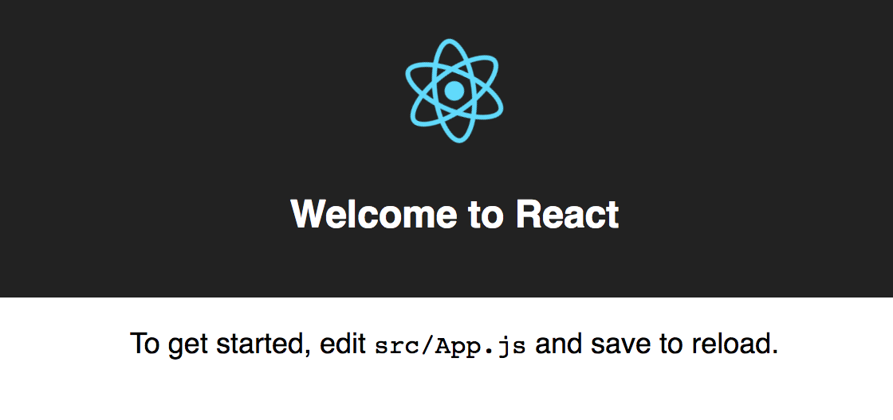

# Chapter 3: Getting Started {#Chapter-3}

In the previous chapter, we covered a conceptual overview of U&I components. Those concepts, however, aren't useful unless we ground our knowledge with practice. This will be the first chapter of a series of implementations covering several strategies for building our application. Due to drastic differences between these U&I strategies, it will be useful to experience first-hand their pros and cons.

In this chapter, we'll build a simple boilerplate to get us up-and-running. Boilerplates are tedious and cumbersome, especially in the JavaScript world; the number of tools and technologies to choose from can be daunting. In addition, React's modular and non-prescriptive eco system doesn't make this any easier. So, instead of dealing with complex build configurations and working up a headache, we'll rely on Facebook's convenient [create-react-app](https://github.com/facebookincubator/create-react-app) command line utility. If you're not familiar with this module, `create-react-app` is a very handy command-line module created by Facebook that encapsulates some of the latest and greatest tools in the React community for a pleasant development experience. For example, we'll have technologies like Webpack for bundling, Babel as our ES6 transpiler, hot module reloading for quicker development, ESLint to keep our code clean and consistent, and many others that are already configured out-of-the-box.

If you don't say it, I will: **That's awesome!**

Their [documentation](https://github.com/facebookincubator/create-react-app) is thorough and useful. I highly recommend reading it, if you plan to go beyond the basics covered in this book.

T> Be sure to have `node` and the other technologies mentioned in the [preface](#Preface). If you have any troubles, you can reference each chapter's source code on [GitHub](https://github.com/FarhadG/ui-react).


## Tools

You may already be familiar with some of the tools in `create-react-app`, however, we should cover the fundamental ones to ensure we have a similar starting point.


### Webpack

{width=50%}


[Webpack](https://webpack.github.io/) is a powerful module bundler. A *bundle* is a JavaScript file that incorporates *assets* that *belong* together and should be served to the client in a response to a single file request. A bundle can include JavaScript, CSS styles, HTML, and almost any other kind of file.

Webpack roams over your application source code, looking for `import` statements, building a dependency graph, and emitting one or more *bundles*. With plugins and rules, Webpack can preprocess and minify different non-JavaScript files such as TypeScript, Sass, LESS, and many others.


### Modern JavaScript with Babel

{width=50%}


[Babel](http://babeljs.io/) is a transpiler for JavaScript best known for its ability to turn ES6 and beyond (the next versions of JavaScript) into code that runs in your browser (or on your server) today.


### JSX

{width=50%}


[JSX](https://jsx.github.io/) is a preprocessor step that adds XML syntax to JavaScript.  Just like XML, JSX tags have a tag name, attributes, and children.  You can definitely use React without JSX but JSX makes React a lot more elegant.


### ESLint

{width=50%}


[ESLint](http://eslint.org/) is an open source JavaScript linting utility. Code [linting](http://en.wikipedia.org/wiki/Lint_(software)) is a type of static analysis that is frequently used to find problematic patterns or code that doesn’t adhere to certain style guidelines. With ESLint, developers can write rules to configure a coding standard for a given project.


### Others

As mentioned earlier, there are countless tools that `create-react-app` configures for us. If you're interested in learning more, you should explore its [repository](https://github.com/facebookincubator/create-react-app).


## Our Project

Are you ready? Lets get started! But, wait… what are we building? We're going to build a very simply application that displays a list of todos. We're going to keep the application simple, so that we focus on architecture and best practices as a basis for scalable UI.

That said, I recommended taking the building blocks of each chapter to build more complex functionality into the app. This will ensure that the concepts presented in this book are reinforced with creative and discoverable practice.


## Boilerplate

Lets install `create-react-app` globally so that we can use it from the command line:

{line-numbers=off}
```bash
$ npm install -g create-react-app
```

Once installed, we can run the following command:

{line-numbers=off}
```bash
$ create-react-app ui-react
```

If everything was successful, our `ui-react` directory should be generated and all of the necessary dependencies were installed. You may also see a list of a few useful `scripts` after the installation process:

{line-numbers=off}
```bash
yarn start
# Starts the development server.

yarn build
# Bundles the app into static files for production.

yarn test
# Starts the test runner.

yarn eject
# Removes this tool and copies build dependencies,
# configuration files and scripts into the app
# directory. If you do this, you can’t go back!
```

For all intents and purposes, we will treat `yarn` and `npm` as being the same. If you're interesting in learning more about these package managers, there are a ton of resources that explain their differences. That said, you can execute commands with either `npm run [command]` or its `yarn` equivalent. 

I> We'll use most of these scripts, except for `test` since there are countless resources online that do a great job explaining how to test your React application.

Lets run the following commands and start our application:

{line-numbers=off}
```bash
$ cd ui-react
$ npm start
```

You should be directed to [http://localhost:3000/](http://localhost:3000/) to see the app running.

{width=50%}



It's quite remarkable that all of the tools ranging from a full test suite, linting, hot reloading, transpiling, etc. have been taken care of for us with a single command. This saves a ton of time, so that we can focus on the important bits of why you're reading this book.


## Overall Structure

Go ahead and open up the application in the editor of your choice so that we can start building the foundation of our application. We'll start off by building the generic version which we'll use as a means to go through the various U&I strategies covered this book.

In our application directory, we'll see the following directories and files:

{line-numbers=off, title=ui-react}
```bash
.gitignore
package.json
public/
  favicon.ico
  index.html
README.md
src/
  App.css
  App.js
  App.test.js
  index.css
  index.js
  logo.svg
```

We'll spend most of our time inside of the `src` directory. A great feature that `create-react-app` provides is a *code-focused* seed by hiding the boilerplate code, configurations and scripts. That said, we'll need to configure `Webpack` as we progress through the chapters, so we're going to `eject` now and have full control from the beginning of our development process.

T> Opting in to `eject` from the beginning of the project is not mandatory, since it's useful to decrease the cognitive load of navigating a larger seed unless needed.

Lets go ahead and `eject` from the `create-react-app` managed seed:

{line-numbers=off}
```bash
$ npm run eject
```

I> This command is permanent and irreversible.

After running the command, you should see that a few additional directories and files were injected into the seed project.

{line-numbers=off, title=ui-react}

```bash
.gitignore
config/ # bundler configurations
package.json
public/
  favicon.ico
  index.html
README.md
scripts/ # node scripts
src/
  App.css
  App.js
  App.test.js
  index.css
  index.js
  logo.svg
```


## A Clean Slate

We're going to start with a clean slate, so go ahead and remove everything from the `src` directory and create a new few file called `index.js`:

{title=src/index.js}
```jsx
// dependencies
import React from 'react';
import { render } from 'react-dom';

const App = () => (
  <div>
    <h1>Hello, World!</h1>
  </div>
);

render(
  <App />,
  document.getElementById('root')
);
```

I> At the time of writing this book, React components must return a single React node, which is why we have to always ensure our components are wrapped in a single HTML element. This may change in the near future.

We'll be making use of some the latest techniques from the JavaScript and React community, as needed, to build our application. As you can see above, we're using ES6 to deconstruct our dependencies and we're using React's pure component syntax for defining `App`.

T> If you're not familiar with ES6, I highly recommend these [free resources](https://github.com/getify/You-Dont-Know-JS) to become an ES6 ninja.

If you visit your browser, you should see our friendly `Hello, World!` message.

{width=50%}


## Summary

In this chapter, we covered some technologies that will be used in later chapters, along with Facebook's `create-react-app` command line utility to quickly bootstrap our application.

In the next chapter, we'll start building the first version of our application using a more traditional component based strategy.