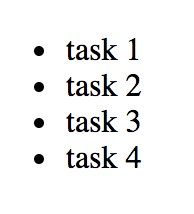
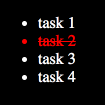

# Chapter 4: Building our App {#Chapter-4}

In the previous chapter we used `create-react-app` to quickly setup a seed project. In this chapter, we're going to start building the first version of our application.

We're going to start by creating everything inside of `index.js` and later refactor everything into separate components. That said, it's generally easier to build components in an isolated fashion, but given that we're just starting, it'll be easier to see everything in one file so that we can capture the entire journey together.


## First pass

We'll first install [Lodash](https://lodash.com/), "a modern JavaScript utility library delivering modularity, performance & extras" with the following command:

{line-numbers=off, lang=text}
```
$ npm install lodash --save
```

Once installed, we can start with code and cover it in detail afterwards:

{title=src/index.js, lang=text}
```
// dependencies
import _ from 'lodash';
import React, { Component } from 'react';
import { render } from 'react-dom';

class App extends Component {

  constructor(...args) {
    super(...args);
    this.state = {
      todos: {}
    };
  }

  componentDidMount() {
    this.setState({
      todos: {
        1: { id: 1, completed: false, description: 'task 1' },
        2: { id: 2, completed: false, description: 'task 2' },
        3: { id: 3, completed: false, description: 'task 3' },
        4: { id: 4, completed: false, description: 'task 4' }
      }
    });
  }

  render() {
    const { todos } = this.state;
    return (
      <ul>
        {_.map(todos, (todo, id) =>
          <li key={id}>
            {todo.description}
          </li>
        )}
      </ul>
    );
  }
}

render(
  <App />,
  document.getElementById('root')
);
```

We've imported `lodash` to help us with common programming tasks in an elegant and concise fashion. We've converted our `App` component from a React pure component to its `class` interface,  since we need internal component state for our todos. In a real world application, you'd use a state manager, such as [Redux](http://redux.js.org/), [Flux](https://facebook.github.io/flux/), [MobX](https://mobx.js.org/), etc but we won't need one here.

To minimize any external dependencies, we won't hit an API to fetch our data, but we'll treat setting our state as if we were. Inside of `componentDidMount`, you can see that we're updating our state's `todos`  with a list of todos. The data structure for a todo item is as follows:

{line-numbers=off, lang=text}
```
1: {
  id: 1,
  completed: false,
  description: 'task 1'
}
```

- `id`: a unique identifier attached to each todo
- `completed`: a boolean determining the todo's status
- `description`: the description for the todo

Why store the todos as an `object` rather than inside of an `array`? I opted to have them stored in an `object` with each todo `id` as the key, since it's easier to reference an individual todo and we can do so in constant time.

In our `render` method, we're grabbing and mapping over our collection of todos via Lodash's `_.map` and rendering them as `li` elements inside of an `ul`.

T> It is good practice to use the `key` prop on elements that we're looping over, so that React can intelligently track them and make internal optimizations.

For the time being, we'll keep these simple without much styling. If you visit your browser, you should see a list of 4 todos rendering in an `ul` tag.


{width=50%}



Now that we have our todos, how do we toggle their status? Let's manually set one of our todos to complete and then define some styles for a completed todo:

{title=src/index.js, line-numbers=off, lang=text}
```
...

  componentDidMount() {
    this.setState({
      todos: {
        1: { id: 1, completed: false, description: 'task 1' },
        // manually set to true
        2: { id: 2, completed: true, description: 'task 2' },
        3: { id: 3, completed: false, description: 'task 3' },
        4: { id: 4, completed: false, description: 'task 4' }
      }
    });
  }

...
```

Add a `completed` class to the `li` elements that are complete:

{title=src/index.js, line-numbers=off, lang=text}
```
...

      <ul>
        {_.map(todos, (todo, id) =>
          <li key={id}
              className={todo.completed ? 'completed' : ''}>
            {todo.description}
          </li>
        )}
      </ul>

...
```

Let's create a `styles.css` file under the `src` directory with a basic set of styles:

{title=src/styles.css, lang=text}
```
body {
  background: black;
  color: white;
}

.completed {
  color: red;
  text-decoration: line-through;
}
```

We're going to leverage Webpack and import our css within `index.js`:

{title=src/index.js, line-numbers=off, lang=text}
```
// dependencies
...

// local dependencies
import './styles.css'

...
```

Visit your browser and you'll see the new styles applied.


{width=50%}



Since we hard coded our `todo`'s completed state, how do we give the user the ability to be able to dynamically toggle that state?

{title=src/index.js, line-numbers=off, lang=text}
```
...

  toggleTodo(id, e) {
    e.preventDefault();
    const todos = _.clone(this.state.todos);
    todos[id].completed = !todos[id].completed;
    this.setState({ todos });
  }
  
...
```

We add the following method, `toggleTodo`, to our `App` class, giving us the ability to toggle our todo. Instead of mutating the original state of our todos, we're cloning an entirely new collection so that we don't run into situations where mutations cause unpredictable behavior. If this is a foreign topic to you, I highly recommend reading more about [immutability](https://en.wikipedia.org/wiki/Immutable_object) within object-oriented and functional programming paradigms.

I> If you're interested in immutable JavaScript data structures, [ImmutableJS](https://facebook.github.io/immutable-js/) is a great open-source candidate.

We need to make our todos trigger our new `toggleTodo` method:

{title=src/index.js, line-numbers=off, lang=text}
```
...

  render() {
    const { todos } = this.state;
    return (
      <ul>
        {_.map(todos, (todo, id) =>
          <li key={id}
              className={todo.completed ? 'completed' : ''}
              onClick={(e) => this.toggleTodo(id, e)}>
            {todo.description}
          </li>
        )}
      </ul>
    );
  }

...
```

If you've been following along, your `index.js` should look like this:

{title=src/index.js, lang=text}
```
// dependencies
import _ from 'lodash';
import React, { Component } from 'react';
import { render } from 'react-dom';

// local dependencies
import './styles.css'

class App extends Component {

  constructor(...args) {
    super(...args);
    this.state = {
      todos: {}
    };
  }

  componentDidMount() {
    this.setState({
      todos: {
        1: { id: 1, completed: false, description: 'task 1' },
        // set to true
        2: { id: 2, completed: true, description: 'task 2' },
        3: { id: 3, completed: false, description: 'task 3' },
        4: { id: 4, completed: false, description: 'task 4' }
      }
    });
  }

  toggleTodo(id, e) {
    e.preventDefault();
    const todos = _.clone(this.state.todos);
    todos[id].completed = !todos[id].completed;
    this.setState({ todos });
  }

  render() {
    const { todos } = this.state;
    return (
      <ul>
        {_.map(todos, (todo, id) =>
          <li key={id}
              className={todo.completed ? 'completed' : ''}
              onClick={(e) => this.toggleTodo(id, e)}>
            {todo.description}
          </li>
        )}
      </ul>
    );
  }
}

render(
  <App />,
  document.getElementById('root')
);
```

Viola! Check out your browser and todo away. Mark them todos like there ain't no tomorrow!


## Styling our App

I know, I know! Our application looks hideous. I'll leave the creative work of making our application *totally fabulous* up to you.

I> If you want to share your beautified versions, pull requests to the [codebase](https://github.com/FarhadG/ui-react) are more than welcome.

However, we will make our application look somewhat decent with some basic styles so that our eyes don't hate us by the end of this book.

{title=src/styles.css, lang=text}
```
html {
  box-sizing: border-box;
}

*, *:before, *:after {
  box-sizing: inherit;
}

body {
  background: #F1F1F1;
  font-size: 10px;
  font-family: "Helvetica Neue", "Arial", "sans-serif";
  margin: 0;
  padding: 0;
}

ul {
  list-style: none;
  margin: 50px auto;
  max-width: 800px;
  padding: 10px 15px;
}

li {
  background: #FAFAFA;
  border-radius: 5px;
  border: 1px solid #E1E1E1;
  box-shadow: 0 2px 1px 0 rgba(0, 0, 0, 0.2);
  color: #888888;
  cursor: pointer;
  font-size: 2rem;
  margin: 10px 0;
  padding: 15px 20px;
  position: relative;
  transition: all 0.2s ease;
}

li:hover {
  opacity: 0.8;
}

.completed {
  background: #E4E4E4;
  box-shadow: inset 0 1px 2px 0 rgba(0, 0, 0, 0.3);
  color: #AAAAAA;
  text-decoration: line-through;
  top: 3px;
}
```

These styles are lean enough to provide some elegance and are simple enough to be cross-browser compatible.

T> Build tools, like Webpack's [Autoprefixer](https://github.com/postcss/autoprefixer), helps keep your CSS cross-browser compatible. 

If you visit your browser, you should see our newly refined application:


## Summary

In this chapter, we laid out the foundation of our application. We introduced some basic concepts that are well established in the React ecosystem and left out others that we will cover in later chapters.

You may be wondering when modularity and encapsulation come into play? Don't worry! We'll be getting into that in the following chapter.