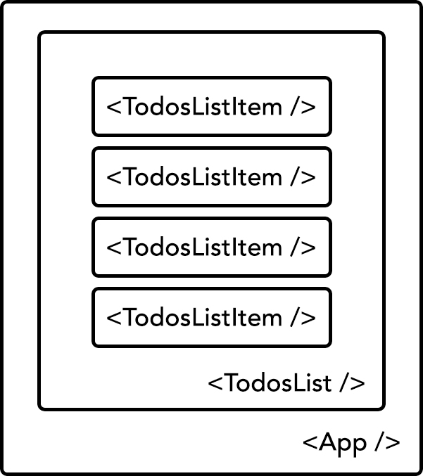

# Chapter 5: Using U&I Concepts {#Chapter-5}

In the previous chapter, we built our first pass of our application using the foundations we laid out using `create-react-app`.

In this chapter, we'll refactor our application into components and cover some U&I concepts in that refactoring process.


## Organization

We can't build large applications within a single file, so we won't do that either. First, create a `components` directory to house the all of our future components:

{line-numbers=off}
```
src/
  components/
  index.js
```

Lets create our first component:

{line-numbers=off}
```
src/
  components/
    App/
      App.css
      App.js
      App.spec.js
  index.js
```

We'll encapsulate all `App` related code inside of our `App` directory. As you can see, we have a `css`, `js` and `spec.js` file describing our `App` component. It is conventional to co-locate all component related code together, so that we can scale and organize our code in a component-centric manner. The focus of this book is not testing, so we won't be working with the `spec.js` files, but I want to provide an example of how you'd organize related files together. When organizing your components, keep modularity and encapsulation in mind; you could even go as far as putting the relevant assets such as images, icons, etc. within that directory as well.

Lets extract `App` from `index.js` and include it within `App.js`:

{title=components/App/App.js}
```jsx
// dependencies
import _ from 'lodash';
import React, { Component } from 'react';

// local dependencies
import './App.css';

export default class App extends Component {

  constructor(...args) {
    super(...args);
    this.state = {
      todos: {}
    };
  }

  componentDidMount() {
    this.setState({
      todos: {
        1: { id: 1, completed: false, description: 'task 1' },
        // set to true
        2: { id: 2, completed: true, description: 'task 2' },
        3: { id: 3, completed: false, description: 'task 3' },
        4: { id: 4, completed: false, description: 'task 4' }
      }
    });
  }

  toggleTodo(id, e) {
    e.preventDefault();
    const todos = _.clone(this.state.todos);
    todos[id].completed = !todos[id].completed;
    this.setState({ todos });
  }

  render() {
    const { todos } = this.state;
    return (
      <ul>
        {_.map(todos, (todo, id) =>
          <li key={id}
              className={todo.completed ? 'completed' : ''}
              onClick={(e) => this.toggleTodo(id, e)}>
            {todo.description}
          </li>
        )}
      </ul>
    );
  }
}
```

Note the imported `App.css` which will contains all `App` related styles, as seen below:

{title=components/App/App.css}
```css
ul {
  list-style: none;
  margin: 50px auto;
  max-width: 800px;
  padding: 10px 15px;
}

li {
  background: #FAFAFA;
  border-radius: 5px;
  border: 1px solid #E1E1E1;
  box-shadow: 0 2px 1px 0 rgba(0, 0, 0, 0.2);
  color: #888888;
  cursor: pointer;
  font-size: 2rem;
  margin: 10px 0;
  padding: 15px 20px;
  position: relative;
  transition: all 0.2s ease;
}

li:hover {
  opacity: 0.8;
}

.completed {
  background: #E4E4E4;
  box-shadow: inset 0 1px 2px 0 rgba(0, 0, 0, 0.3);
  color: #AAAAAA;
  text-decoration: line-through;
  top: 3px;
}
```

It contains nearly everything from our previous `styles.css` file, without the global styles that are not tied to `App`. Lastly, lets update `index.js` and `styles.css` to reflect these changes:

{title=src/index.js}
```jsx
// dependencies
import React from 'react';
import { render } from 'react-dom';

// local dependencies
import App from './components/App/App';
import './styles.css';

render(
  <App />,
  document.getElementById('root')
);
```

We import our `App` component and render everything just like before. Lets remove the duplicated styles from `styles.css`:

{title=src/styles.css}
```css
html {
  box-sizing: border-box;
}

*, *:before, *:after {
  box-sizing: inherit;
}

body {
  background: #F1F1F1;
  font-size: 10px;
  font-family: "Helvetica Neue", "Arial", "sans-serif";
  margin: 0;
  padding: 0;
}
```

If everything went according to plan, you should see our application render just as it did before.


## Necessary Components

That's all nice and dandy, but we haven't done much with this refactor, other than co-locate our `App` related code. Before we move onto the more interesting bits of our refactoring, we need to outline the necessary components needed to build our application. This sort of planning is crucial to any U&I development.


{width=60%}



### On <App />

Our `App` component will be entry point for our app, instantiating our top-level components. Essentially, we'd like for `App` to do the following:

- `fetch` a set of todos
- `manage` these set of todos
- `update` these todos
- `pass` the ability to `update` these todos to child components
- `render`  our todos


### On <TodosList />

Since `App` doesn't really deal with the actual todos UI directly, we'll create a `TodosList` component, which will serve the following purpose(s):

- `accept` a list of todos
- `render` a list of todo items

You can think of `TodosList` as an `ordered` or `unordered` list that simply renders any set of `children` passed down to it. You may be wondering why we need to modularize our `TodosList` in this fashion, but we'll later see the power of separating our actual todo items from the todos list where our `TodosList` can render any sort of items, not just our todo list items.


### On <TodosListItem />

Our app instantiates manages our todos and we have a list that renders a list of children, but we haven't defined the actual todo item. This is where `TodosListItem` comes into the picture. In our previous step, I mentioned why it's a good idea to separate our todo items from the todo list.  Even though we won't be building different types of todo items, you can, for example, imagine cases where `TodosList` can render a variety of different todo items, such as `TodosListItem`,  `TodosListItemWithIcon`, `TodosListItemThatNeverGetsFinishedCuzItsRequiresWayTooMuchWorkToComplete`, and so forth. These are, of course, examples but it's a good idea to have these separated instead of having `TodosList` bound to only rendering only one type of todo item component.

The point of our `TodosListItem` is quite simple:

- `accept` a todo
- `accept` a callback to be able to `toggle` our todo's complete status
- `render` the todo item


### Others?

Any other necessary components? Nope! That's it! Well, at least for now.

As mentioned earlier, we're going to keep the app minimal so that we can focus on the strategies rather than the slue of other topics that can bleed into this domain.


### Building <TodosList />

But first, lets finish up what we started and refactor our components to meet the layout spec we defined above. Lets create a `TodosList` directory along with its associated files.

{line-numbers=off}
```
src/
  components/
    App/
    TodosList/
      TodosList.css
      TodosList.js
      TodosList.spec.js
  index.js
```

Then, create our `TodosList` as a `ul` that simply renders the `children` passed down via `props`:

{title=src/components/TodosList/TodosList.js}
```jsx
// dependencies
import React from 'react';

// local dependencies
import './TodosList.css';

export default ({ children }) => (
  <ul>
    {children}
  </ul>
);
```

We deconstruct our `props` and pick out `children`. We don't need any sort of lifecycle methods, so we defined it as a React's pure component.

We've also imported `TodosList.css`, which extracts out the relevant styles from `App.css`:

{title=src/components/TodosList/TodosList.css}
```css
ul {
  list-style: none;
  margin: 50px auto;
  max-width: 800px;
  padding: 10px 15px;
}
```

Lets now update `App` to use `TodosList`:

{title=src/components/App/App.js}
```jsx
// dependencies
...

// local dependencies
...
import TodosList from '../TodosList/TodosList';

...

  render() {
    const { todos } = this.state;
    return (
      <TodosList>
        {_.map(todos, (todo, id) =>
          <li key={id}
              className={todo.completed ? 'completed' : ''}
              onClick={(e) => this.toggleTodo(id, e)}>
            {todo.description}
          </li>
        )}
      </TodosList>
    );
  }

...
```

We import our `TodosList` and replace our `ul` with our `TodoList` which, for the time being, behaves very similar to the previous `ul` html element.

We also remove the styles associated with our `TodosList` from `App.css`, so we don't have any sort of duplication or style clashes. Here's the updated `App.css` without the `ul` styles:

{title=src/components/App/App.css}
```css
li {
  background: #FAFAFA;
  border-radius: 5px;
  border: 1px solid #E1E1E1;
  box-shadow: 0 2px 1px 0 rgba(0, 0, 0, 0.2);
  color: #888888;
  cursor: pointer;
  font-size: 2rem;
  margin: 10px 0;
  padding: 15px 20px;
  position: relative;
  transition: all 0.2s ease;
}

li:hover {
  opacity: 0.8;
}

.completed {
  background: #E4E4E4;
  box-shadow: inset 0 1px 2px 0 rgba(0, 0, 0, 0.3);
  color: #AAAAAA;
  text-decoration: line-through;
  top: 3px;
}
```


### Building <TodosListItem />

Lets create a new directory to contain all of the files associated with `TodosListItem`:

{line-numbers=off}
```
src/
  components/
    App/
    TodosList/
    TodosListItem/
      TodosListItem.css
      TodosListItem.js
      TodosListItem.spec.js
  index.js
```

Now, lets visit our `TodosListItem.js`:

{title=src/components/TodosListItem/TodosListItem.js}
```jsx
// dependencies
import React from 'react';

// local dependencies
import './TodosListItem.css';

export default ({ todo, handleClick }) => (
  <li className={todo.completed ? 'completed' : ''}
      onClick={(e) => handleClick(e, todo.id)}>
    {todo.description}
  </li>
);
```

We import the `css` associated with our component, opt for the React's pure component interface since the overhead of a component class is not needed and deconstructed the props.

I> We removed the `key` attribute because the looping doesn't happen within the component but rather the component's consumer instantiating it one or more times.

Lastly, we bring over the styles relevant to `TodosListItem`, which are, at the moment, all of the styles inside of `App.css`.

{title=src/components/TodosListItem/TodosListItem.css}
```css
li {
  background: #FAFAFA;
  border-radius: 5px;
  border: 1px solid #E1E1E1;
  box-shadow: 0 2px 1px 0 rgba(0, 0, 0, 0.2);
  color: #888888;
  cursor: pointer;
  font-size: 2rem;
  margin: 10px 0;
  padding: 15px 20px;
  position: relative;
  transition: all 0.2s ease;
}

li:hover {
  opacity: 0.8;
}

.completed {
  background: #E4E4E4;
  box-shadow: inset 0 1px 2px 0 rgba(0, 0, 0, 0.3);
  color: #AAAAAA;
  text-decoration: line-through;
  top: 3px;
}
```

Lets update `App.js` to reflect these changes:

{title=src/components/App/App.js, line-numbers=off}
```jsx
// dependencies
...

// local dependencies
...
import TodosListItem from '../TodosListItem/TodosListItem';

...

  render() {
    const { todos } = this.state;
    return (
      <TodosList>
        {_.map(todos, (todo, id) =>
          <TodosListItem key={id}
                         todo={todo}
                         handleClick={this.toggleTodo.bind(this)} />
        )}
      </TodosList>
    );
  }

...
```

We pass the necessary `props` to our `TodosListItem` and `bind` our `handleClick` method to the correct context, since we'll need it at the time of a state update. It's best practice to bind these callbacks only once. You can do in either the constructor or somewhere appropriate. We can also make use Babel's ES6+ presets to be able to `auto bind` our methods.

Lets see how that looks:

{title=src/components/App/App.js, line-numbers=off}
```jsx
...

leanpub-start-delete
  toggleTodo(id, e) {
    ...
  }
leanpub-end-delete
  
leanpub-start-insert
  toggleTodo = (id, e) => {
    ...
  };
leanpub-end-insert
  
...
```

It's a subtle difference, but this syntax provided by Babel auto binds our methods to our class. Lastly, we need to update the prop reference:

{title=src/components/App/App.js, line-numbers=off}
```jsx
...

          <TodosListItem key={todo.id}
                         todo={todo}
                         toggleTodo={this.toggleTodo} />
                         
...
```

I've found this syntax elegant and preferable to the `::` syntax or binding within the constructor.

Another pattern I've started using are [higher-order functions](http://eloquentjavascript.net/05_higher_order.html) when additional arguments are needed *(such as the index of an item in a loop)*. For example, we can update our method to the following:

{title=src/components/TodosListItem/TodosListItem.js, line-numbers=off}
```jsx
...

leanpub-start-delete
  toggleTodo = (id, e) => {
    ...
  };
leanpub-end-delete
  
leanpub-start-insert
  toggleTodo = (id) => (e) => {
    ...
  };
leanpub-end-insert
  
...
```

The first time our new `toggleTodo` gets called, we return a new function waiting to be called with `e` as the argument and the todo `id` stored in a closure.

We need to update how we call our new method inside of `TodosListItem`:

{title=src/components/App/App.js, line-numbers=off}
```jsx
...

leanpub-start-delete
export default ({ todo, handleClick }) => (
  <li className={todo.completed ? 'completed' : ''}
      onClick={(e) => handleClick(todo.id, e)}>
    {todo.description}
  </li>
);
leanpub-end-delete
  
leanpub-start-insert
export default ({ todo, handleClick }) => (
  <li className={todo.completed ? 'completed' : ''}
      onClick={handleClick(todo.id)}>
    {todo.description}
  </li>
);
leanpub-end-insert
  
...
```


Open your browser and you should see everything working.


## Considering U&I Concepts

So far, we've covered some best practices covering component encapsulation and composition, by co-locating component related code and having "focused" components.

That's great, but our styles are global and doomed to fail as we scale our application. **This is where the real pain resides.** We'll need to try a new strategy to guide us towards building U&I components.


### Name Spacing Components

If you haven't already started thinking about how to name space components, I highly encourage you to do so. There are many useful techniques that help keep CSS styles from clashing but only a few work well with co-located styles. 


#### Application Name Spacing

One powerful technique is name spacing your entire app. That is, every component rendered in your app is a child of the root app, so you can increase CSS specificity by name spacing it with a unique ID. This is great to help avoid situations where your application uses an external UI that may clash with your CSS selectors.


#### Component Name Spacing

You may already be familiar with naming conventions, such as [BEM](http://getbem.com/), [SUIT](https://github.com/suitcss/suit/blob/master/doc/naming-conventions.md), etc. which would play well with [CEM (Component Element Modifier)](https://atendesigngroup.com/blog/component-element-modifier-design-pattern). We won't use BEM here, but you may decide to follow BEM as a naming convention to mitigate CSS name collision. Since BEM is well covered, we'll use a simpler version of CEM, given that our application is quite lean.

I> It's more semantic to namespace components with CSS classes rather than IDs. Since components, by nature, may be rendered several times within a single application, CSS classes are semantically more appropriate.


### Unidirectional styling

If you have any experience with React or any of its popular state managers, you'll know the principle of [unidirectional data](http://redux.js.org/docs/basics/DataFlow.html). We've already seen this in action by not allowing child components, such as our `TodosListItem`, to mutate the state of its parent directly, but rather by having an interface to invoke a callback to perform those operations. That way, our `TodosListItem` is simply a representation of the data. As the data updates, it flow downwards, to the child components, in a unidirectional top-down fashion. Similarly, if we treat our styles as "data," we can employ a similar strategy that our styles flow "downwards," as seen here:


{width=60%}


As you can see from the diagram above, we should aim for styles to be "intra-focused" and cascade downwards. In principle, we should avoid any sort of styles that extend beyond their own scopes.


### Extendibility

Following a rigorous component design strategy lends itself to the ability for component consumers to be able to extend or modify a component's inner workings with ease. One of the worst situations in UI development is using UI elements that are extremely difficult to modify or are inherently "locked." When building a U&I component, we need to design with empathy, by considering the component's consumers.


### In Action

Now, onto the fun part where we get to apply these concepts.


#### Implementing App Name Spacing

You may have already noticed that we're mounting our entire application to an HTML element with an ID of `root`. Lets leverage what we already have and simply make a semantic change.

{title=public/index.html, line-numbers=off}
```html
...

leanpub-start-insert
    <div id="root"></div>
leanpub-end-insert

leanpub-start-insert
    <div id="todos-app"></div>
leanpub-end-insert

...
```

We name space our application with `todos-app` where our entire React application is mounted into the DOM.

{title=src/index.js, line-numbers=off}
```jsx
...

render(
  <App />,
  document.getElementById('todos-app')
);
```

We update our app's entry point, ensuring we're targeting the correct mounting HTML element. Everything else remains the same. We've simply introduced a semantic change for name spacing our entire application under an identifiable CSS id.

You may then be wondering that within our `styles.css`, we're targeting many global HTML elements. That is perfectly fine! Again, once we consider our unidirectional styling criteria, we quickly see that these styles are applied to all elements within our application. These sorts of resets and global styles are common in applications, so it's ideal to keep them sitting at the very top of our application.


#### Implementing Component Name Spacing

Lets see how our other U&I concepts get applied to our components.

Our `index.js` and `styles.css` remain the same. So, lets move onto our first component: `App`:

{title=src/components/App/App.js}
```jsx
// dependencies
...

// local dependencies
...

export default class App extends Component {

  constructor(...args) {
    ...
  }

  componentDidMount() {
    ...
  }

  toggleTodo = (id) => (e) => {
    ...
  };

  generateTodosListItem = (todo, id) => (
    <TodosListItem key={id}
                   todo={todo}
                   handleClick={this.toggleTodo} />
  );

  render() {
    const { todos } = this.state;
    return (
      <div className="app">
        <TodosList>
          {_.map(todos, this.generateTodosListItem)}
        </TodosList>
      </div>
    );
  }
}
```

Our main `App` component remains mostly the same, except for two things:

- A function for generating our `TodosListItem` in order to keep our `render` method lean.
- Nesting our components within a top level `div` with the appropriate class name `app`.

We create another function for generating our `TodosListItem` to keep our `render` method lean. It gets difficult reading and debugging large `render` methods.

Lets visit our second component: `TodosList`.

{title=src/components/TodosList/TodosList.js}
```jsx
// dependencies
import React, { PropTypes } from 'react';

// local dependencies
import './TodosList.css';

const TodosList = ({ children }) => (
  <ul className="todos-list">
    {children}
  </ul>
);

TodosList.propTypes = {
  children: PropTypes.oneOfType([
    PropTypes.array,
    PropTypes.element
  ])
};

export default TodosList;
```

Our `TodosList` remains mostly the same, except that we add a `todos-list` class to component as a way to namespace our component. In addition, it's always a good idea to perform some `propType` validation, so those have also been introduced.

The updated `TodosList` styles:

{title=src/components/TodosList/TodosList.css}
```css
#todos-app .todos-list {
  list-style: none;
  margin: 50px auto;
  max-width: 800px;
  padding: 10px 15px;
}
```

Yup, quite simple! Instead of applying the styles to `ul`, we've targeted our component by first targeting our application and then the component.

For our final component, `TodosListItem`, we'll need a new dependency, [`classnames`](https://github.com/JedWatson/classnames), to help handle conditional styles in a more elegant fashion. Go ahead and install this new dependency:

{line-numbers=off}
```bash
$ npm install classnames --save
```

Now we can visit our `TodosListItem` component:

{title=src/components/TodosListItem.js}
```jsx
// dependencies
import _ from 'lodash';
import classNames from 'classnames';
import PropTypes from 'prop-types';
import React from 'react';

// local dependencies
import './TodosListItem.css';

const TodosListItem = ({ todo, handleClick }) => (
  <li className={classNames('todos-list-item', { completed: todo.completed })}
      onClick={handleClick(todo.id)}>
    {todo.description}
  </li>
);

TodosListItem.defaultProps = {
  todo: {},
  toggleTodo: _.noop
};

TodosListItem.propTypes = {
  todo: PropTypes.shape({
    completed: PropTypes.boolean,
    description: PropTypes.string,
    id: PropTypes.number
  }),
  handleClick: PropTypes.func
};

export default TodosListItem;
```

A few things were updated within our `TodosListItem` component:

- We name space our component with a css class.
- Imported our new `classnames` module. This useful module allows for us to define complex classnames in an intuitive manner. For example, in our render method, we apply the `todos-list-item` class regardless, however, if the `todo.completed` state is true, it also adds the `completed` class. That is, if the todo is completed, it gets `todos-list-item completed`; if not, only `todos-list-item` is returned. You can, obviously, add many more conditionals for more complex classnames. You can read up more on `classnames` in their [documentation](https://github.com/JedWatson/classnames).
- We set `defaultProps` to ensure way have some sane prop values when our `TodosListItem` is rendered. The `noop` function is a no-operation function which we'll use, so we don't get an error if no `handleClick` function was provided.
- As before, we check our props with `propType` validation.

Of course, this component would not be complete until we updated the `.css` file associated with our `TodosListItem` component.

{title=src/components/TodosListItem/TodosListItem.css}
```css
#todos-app .todos-list-item {
  background: #FAFAFA;
  border-radius: 5px;
  border: 1px solid #E1E1E1;
  box-shadow: 0 2px 1px 0 rgba(0, 0, 0, 0.2);
  color: #888888;
  cursor: pointer;
  font-size: 2rem;
  margin: 10px 0;
  padding: 15px 20px;
  position: relative;
  transition: all 0.2s ease;
}

#todos-app .todos-list-item:hover {
  opacity: 0.8;
}

#todos-app .todos-list-item.completed {
  background: #E4E4E4;
  box-shadow: inset 0 1px 2px 0 rgba(0, 0, 0, 0.3);
  color: #AAAAAA;
  text-decoration: line-through;
  top: 3px;
}
```

Just like before, we target our elements through our application ID and then our component class.


#### Implementing Extendable & Unidirectional Styling

It may appear that we're done, however, we forgot two important concepts: extendable and unidirectional styling. Can you spot which component's styles are extending beyond their scope?

The `margin`s set in `TodosList` and `TodosListItem` are extending beyond their own scope. That is, they affect the behavior outside of themselves. It may appear silly to point these out in a small application, but components may conflict if you don't follow the contract you've set out to fulfill in the first place. It may be perfectly reasonable to keep them as is, however, we'll go through the exercise to see how we'd resolve this issue. Since we're still in CSS land, we cascade our styles over our component name spaced interface.

Lets start from the children first:

{title=src/components/TodosListItem/TodosListItem.css}
```css
#todos-app .todos-list-item {
  background: #FAFAFA;
  border-radius: 5px;
  border: 1px solid #E1E1E1;
  box-shadow: 0 2px 1px 0 rgba(0, 0, 0, 0.2);
  color: #888888;
  cursor: pointer;
  font-size: 2rem;
leanpub-start-delete
  margin: 10px 0;
leanpub-end-delete
  padding: 15px 20px;
  position: relative;
  transition: all 0.2s ease;
}

#todos-app .todos-list-item:hover {
  opacity: 0.8;
}

#todos-app .todos-list-item.completed {
  background: #E4E4E4;
  box-shadow: inset 0 1px 2px 0 rgba(0, 0, 0, 0.3);
  color: #AAAAAA;
  text-decoration: line-through;
  top: 3px;
}
```

We remove the `margin` from `TodosListItem.css` and include it in `TodosList`:

{title=src/components/TodosListItem/TodosListItem.css}
```css
#todos-app .todos-list {
  list-style: none;
  padding: 10px 15px;
leanpub-start-delete
  margin: 50px auto;
  max-width: 800px;
leanpub-end-delete
}

leanpub-start-insert
#todos-app .todos-list .todos-list-item {
  margin: 10px 0;
}
leanpub-end-insert
```

We also remove the `max-width` and `margin` from `TodosListItem` and include it in the parent component:

{title=src/components/App/App.css}
```css
#todos-app .app {

}

#todos-app .app .todos-list {
  margin: 50px auto;
  max-width: 800px;
}
```

If you visit the browser, the entire application may appear the same, but the truth is that it's built with a foundation suited for U&I focused components.


## Summary

In this chapter, we outlined some concepts that are a great starting point on the U&I journey. Even though these are great practices for building U&I components, they are not, technically, bulletproof. That is, we can still run into issues with style collisions.

Overall, they provide a solid foundation to tackle some of our U&I criteria. Lets take a quick look at where we stand in relation to the U&I contract we defined in [Chapter 2](#Chapter-2).


|                                 | CSS
|---------------------------------|:---:|
| **No global namespace**         |  -  |
|---------------------------------|-----|
| **Unidirectional styles**       |  ✔  |
|---------------------------------|-----|
| **Dead code elimination**       |     |
|---------------------------------|-----|
| **Minification**                |     |
|---------------------------------|-----|
| **Shareable constants**         |     |
|---------------------------------|-----|
| **Deterministic resolution**    |  -  |
|---------------------------------|-----|
| **Isolation**                   |  -  |
|---------------------------------|-----|
| **Extendable**                  |  -  |
|---------------------------------|-----|
| **Documentable**                | NA  |
|---------------------------------|-----|
| **Presentable**                 | NA  |
|---------------------------------|-----|

✔ Fulfilled <br/>
- Pseudo fulfilled


Some of them are `pseudo` completed, signifying that they don't completely fulfill the criteria but are *close enough* given clear guidelines and best practices. Additionally, we won't cover **Documentable** and **Presentable** until later chapters, so we'll ignore them for the time being.

Even though we weren't able to fulfill all of our U&I criteria and some were only *pseudo* fulfilled, this may be more than enough for many U&I requirements. From my experience, following these basic principles is already way ahead of the many applications I've come across that contain high dependency between components with styles extending beyond their scope.

Phew! We're done! Well, sort of… Here's a quick recap of what we covered in this chapter:

- Modularize your components.
- Build composable components when appropriate. For example, we could've have had our `TodosListItem` built right into our `TodosList` component as either `li` elements or have `TodosList` directly render `TodosListItem`, however, we opted for a composable component, so that `TodosList` can, theoretically, render a variety of different types of todo item components.
- Name space, intelligently. That is, increase your CSS specificity and bring some structure to your app by name spacing your components.
- Keep your `render` methods lean and focused, so it's easy to read and debug.
- Keep your components focused, functional and sustainable.
- Be sure to define and protect your component API with default props and prop type validation.
- Most importantly, think about your component styles unidirectionally. That is, styles should flow downwards, from parent to child. We should try to avoid component styles extending beyond their scope, unless there is absolutely good reason for it.

Lets move onto our next chapter to see how we can further clean up our components.