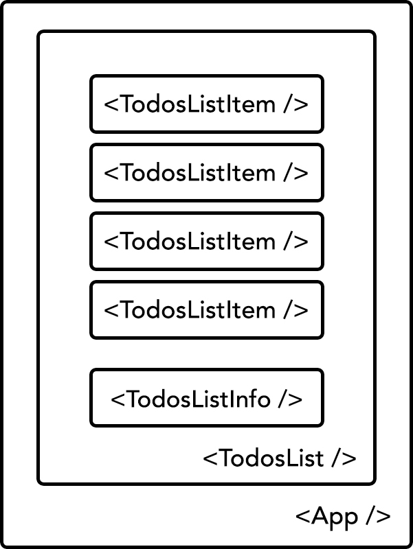

# Chapter 6: Exploring CSS Preprocessors {#Chapter-6}

In the previous chapter, we covered some U&I best practices to guide us on refactoring our application. In this chapter, we'll leverage a CSS preprocessor to help us adhere to those principles.


## What is a CSS Preprocessor?

A preprocessor is a program transforms one type of data to another. In the case of CSS, we can leverage a preprocessors to extend CSS with variables, operators, interpolations, functions, mixins and many more other usable assets. 


## Why use a Preprocessor?

CSS is primitive and incomplete. CSS preprocessors offer us many useful and advanced features that help to achieve writing reusable, maintainable and extensible code in CSS. By using a preprocessor, you can easily increase your productivity and decrease the amount of code you are writing.


## Meet Sass

Although there are many powerful CSS preprocessors, such as [Stylus](http://stylus-lang.com/), [Less](http://lesscss.org/), [Myth](http://www.myth.io/), etc., we'll be using [Sass](http://sass-lang.com/). Sass has grown in popularity for a variety of reasons — most notably where Bootstrap dropped Less in favor of Sass with their Bootstrap 4 release. That said, feel free to use whichever CSS preprocessor you feel most comfortable with, given that they offer many of the same sorts of features with very little difference in syntax and style.


## Sass in Action

Since we bootstrapped our app using `create-react-app`, we'll need to modify our Webpack to be able to support  `.scss` files. This is one of the reasons we executed the `eject` script, so that we could eventually modify `create-react-app`'s config.

Lets install a Webpack `sass` loader:

{line-numbers=off}
```bash
$ npm install sass-loader node-sass --save-dev
```

We only install these dependencies as `dev-dependencies`, since they're only needed in our build pipeline. Once installed, you can find the webpack configuration files inside `/config`. We're only concerned with `development`, but you can follow a similar set of steps for other environments as well.

{title=config/webpack.config.dev.js, line-numbers=off}
```javascript
...

      {
# leanpub-start-delete
        test: /\.css$/,
# leanpub-end-delete
# leanpub-start-insert
        test: /\.(css|scss)$/,
# leanpub-end-insert
        use: [
          require.resolve('style-loader'),
          {
            loader: require.resolve('css-loader'),
            options: {
              importLoaders: 1,
            },
          },
          {
            loader: require.resolve('postcss-loader'),
            options: {
              ident: 'postcss',
              plugins: () => [
                require('postcss-flexbugs-fixes'),
                autoprefixer({
                  browsers: [
                    '>1%',
                    'last 4 versions',
                    'Firefox ESR',
                    'not ie < 9',
                  ],
                  flexbox: 'no-2009',
                }),
              ],
            },
          },
# leanpub-start-insert
          require.resolve('sass-loader')
# leanpub-end-insert
        ],
      },

...
```

Your Webpack configuration may vary slightly, but essentially, you'll need to find and update your css loader to be able to run the appropriate loaders over both `.css` and `.scss` files.

Go ahead and restart your project by running `npm start` and everything should work just as before. Now, it's time to refactor our styles, component by component, by leveraging Sass.

If this did not work with your version of `create-react-app`, you can try the following:

{title=config/webpack.config.dev.js, line-numbers=off}
```javascript
      {
        exclude: [
          /\.html$/,
          /\.(js|jsx)(\?.*)?$/,
# leanpub-start-delete
          /\.css$/,
# leanpub-end-delete
# leanpub-start-insert
          /\.(css|scss)$/,
# leanpub-end-insert
          /\.json$/,
          /\.svg$/
        ],
        loader: 'url',
        query: {
          limit: 10000,
          name: 'static/media/[name].[hash:8].[ext]'
        }
      },
```


T> If you continue to encounter issues, please refer to this book's [source code](https://github.com/FarhadG/ui-react) to inspect the versions of the dependencies and the Webpack configuration used.

We won't be using all of the features that Sass provides, but we will cover a few fundamental features. For example, one powerful technique to increase CSS specificity is nesting. Of course, you don't necessarily need to use a preprocessor to do this as you can write out the classes with plain ol' CSS, but that's tedious and error prone.


### Configuring our Styles

Lets first create a `styles` directory which would most likely contain global files (e.g. `theme.scss`, `typography.scss`, etc.) in a production-grade application.

{title=src/styles/theme.scss}
```scss
$APP: 'todos-app';

$main-background-color: #F1F1F1;
$main-font-family: "Helvetica Neue", "Arial", "sans-serif";

$light-gray: #FAFAFA;
$dark-gray: #888888;
```

We use a variable for defining our app name, along with some color variables.

We move our `styles.css` file into our `styles` directory and rename it as `globals.scss`:

{title=src/styles/globals.scss}
```scss
html {
  box-sizing: border-box;
}

*, *:before, *:after {
  box-sizing: inherit;
}

body {
  background: #F1F1F1;
  font-size: 10px;
  font-family: "Helvetica Neue", "Arial", "sans-serif";
  margin: 0;
  padding: 0;
}
```

Since these will be the entry styles for our entire application, we'll create a new file, `main.scss` which imports all general `.scss` files to bootstrap our application.

{title=src/styles/main.scss}
```scss
@import "theme.scss";
@import "globals.scss";
```

Since we moved and renamed `styles.css`, we'll import `main.scss` to bootstrap our application:

{title=src/index.js}
```js
// dependencies
...

// local dependencies
...
# leanpub-start-delete
import './styles.css';
# leanpub-end-delete

# leanpub-start-insert
import './styles/main.scss';
# leanpub-end-insert

...
```

That said, we really haven't made use of our `theme.scss` files other than import it, so lets use that within our `globals.scss` file.

{title=src/styles/globals.scss}
```scss
...

body {
  background: $main-background-color;
  font-size: 10px;
  font-family: $main-font-family;
  margin: 0;
  padding: 0;
}
```

Since we import `main.scss` file which contains `theme.scss` within its context, we can reference those variables. Our `$main-background-color` may be a common enough of a color that we've extracted it out to our `theme.scss` file so that we can reference it throughout our application. In a larger application, it's important to adhere to a particular naming convention, just as we do everywhere else.


### Refactoring <App />

Update `App.css` to `App.scss` and update our `import` statement:

{title=src/components/App/App.js}
```jsx
// dependencies
...

// local dependencies
...
# leanpub-start-delete
import './App.css';
# leanpub-end-delete

# leanpub-start-insert
import './App.scss';
# leanpub-end-insert

...
```

Then, make the following style changes:

{title=src/components/App/App.scss}
```css
@import '../../styles/theme';

##{$APP} .app {

  .todos-list {
    margin: 50px auto;
    max-width: 800px;
  }

}
```

This is where our app ID becomes useful. We import `theme.scss` and we interpolate our `$APP` variable to name space our component. The syntax may look a bit strange but all we're doing is setting an ID (i.e. `#`) and interpolating our `$APP` variable with the `#{VARIABLE}` syntax. Now, we can easily skin our entire application in different contexts by switching themes with one variable.


### Refactoring <TodosList />

Update `TodosList.css` to `TodosList.scss` and update our import statement:

{title=src/components/TodosList/TodosList.js}
```jsx
// dependencies
...

// local dependencies
...
# leanpub-start-delete
import './TodosList.css';
# leanpub-end-delete

# leanpub-start-insert
import './TodosList.scss';
# leanpub-end-insert

...
```

Then, make the following style changes:

{title=src/components/TodosList/TodosList.scss}
```scss
@import '../../styles/theme';

##{$APP} .todos-list {
  list-style: none;
  padding: 10px 15px;

  &-item {
    margin: 10px 0;
  }
}
```

We use the `&` operator to keep our code dry. The `&` operator inside of a selector concatenates the name of the parent in its place, so we are left with `.todos-list-item`.


### Refactoring <TodosListItem />

Update `TodosListItem.css` to `TodosListItem.scss` and update our import statement:

{title=src/components/TodosListItem/TodosListItem.js}
```jsx
// dependencies
...

// local dependencies
...
# leanpub-start-delete
import './TodosListItem.css';
# leanpub-end-delete

# leanpub-start-insert
import './TodosListItem.scss';
# leanpub-end-insert

...
```

Then, make the following style changes:

{title=src/components/TodosListItem/TodosListItem.scss}
```scss
@import '../../styles/theme';

##{$APP} .todos-list-item {
  background: $light-gray;
  border-radius: 5px;
  border: 1px solid #E1E1E1;
  box-shadow: 0 2px 1px 0 rgba(0, 0, 0, 0.2);
  color: $dark-gray;
  cursor: pointer;
  font-size: 2rem;
  padding: 15px 20px;
  position: relative;
  transition: all 0.2s ease;

  &:hover {
    opacity: 0.8;
  }

  &.completed {
    background: darken($light-gray, 10);
    box-shadow: inset 0 1px 2px 0 rgba(0, 0, 0, 0.3);
    color: #AAAAAA;
    text-decoration: line-through;
    top: 3px;
  }
}
```

All of our `.todos-list-item` styling are nested and we've made use of the `&` operator to be able to nest additional selectors tied to `.todos-list-item`.

We also use the `darken` function. Instead of dealing with another css color, we can leverage useful Sass operations, such as `darken`, to modify existing colors.

I> CSS preprocessors like Sass have many useful operators that can make working with CSS a breeze. Be sure to leverage them in your projects.


## Enhancements

Now that we have a good flow for creating components, we're going to introduce one additional component, as a means to show the ease of our existing architecture.


{width=60%}



### On <TodosListInfo />

We will introduce a new component that sits inside of our `TodosList`, providing some basic information about the state of our todos.

Lets first start by creating our component directory and files:

{line-numbers=off, title=ui-react}
```
src/
  components/
    TodosListInfo/
      TodosListInfo.scss
      TodosListInfo.js
      TodosListInfo.spec.js
```

Next, we'll make a component rendering the number of todos remaining over the total number of todos.

{src=src/components/TodosListInfo/TodosListInfo.js}
```jsx
// dependencies
import _ from 'lodash';
import React, { PropTypes } from 'react';

// local dependencies
import TodosListItem from '../TodosListItem/TodosListItem';
import './TodosListInfo.scss';

const TodosListInfo = ({ todos }) => {
  const todosCount = _.size(todos);
  const completedTodosCount = _(todos).filter('completed').size();
  return (
    <li className="todos-list-info">
      {completedTodosCount}/{todosCount} completed
    </li>
  );
};

TodosListInfo.defaultProps = {
  todos: []
};

TodosListInfo.propTypes = {
  todos: PropTypes.objectOf(TodosListItem.propTypes.todo)
};

export default TodosListInfo;
```

Of course we need some styles:

{src=src/components/TodosListInfo/TodosListInfo.scss}
```scss
@import '../../styles/theme';

##{$APP} .todos-list-info {
  color: $dark-gray;
  font-size: 14px;
  text-align: right;
}
```

We use a few useful Lodash functions to filter and count the number of todos. We also import `TodosListItem` to reuse the same prop types validation definitions. This may suggest a deep dependency between these two different components, but a single source of truth for these validations is good practice.

If these dependencies becomes unmaintainable, there are several patterns that can help decouple components from one another:

1. Create an entry file within your `components` directory that exports all components from a single source.
2. Extract all component `propTypes` into a shared resource as a single source of truth.

We'll keep things simple in our project, but it's good to be aware of your application's dependency management as the number of U&I components grow.

Lets use our new component:

{src=src/components/App/App.js}
```jsx
// dependencies
...

// local dependencies
...
import TodosListInfo from '../TodosListInfo/TodosListInfo';

class App extends Component {

  constructor(...args) {
    ...
  }

  componentDidMount() {
    ...
  }

  toggleTodo = (id) => (e) => {
    ...
  };

  generateTodosListItem = (todo, id) => (
    ...
  );

  render() {
    const { todos } = this.state;
    return (
      <div className="app">
        <TodosList>
          {_.map(todos, this.generateTodosListItem)}
          <TodosListInfo todos={todos} />
        </TodosList>
      </div>
    );
  }
}

export default App;
```

We import our `TodosListInfo` component and render inside of `TodosListItem` with the appropriate props. By now, the advantages of decoupling components and ensuring a clear separation of roles should be clear.

Open your browser and you should see our new component rendering real-time updates on our todos.


## Summary

In this chapter, we introduced Sass, a CSS preprocessor, and leveraged some of its common features to help maintain some of the practices we laid out in earlier chapters. We also added a new component as a means to test the simplicity of adding a new component to our U&I suite.

Where did we end up with our U&I checklist?


|                                 | CSS | SCSS
|---------------------------------|:---:|:----:|
| **No global namespace**         |  -  |  -   |
|---------------------------------|-----|------|
| **Unidirectional styles**       |  ✔  |  ✔  |
|---------------------------------|-----|------|
| **Dead code elimination**       |     |      |
|---------------------------------|-----|------|
| **Minification**                |     |      |
|---------------------------------|-----|------|
| **Shareable constants**         |     |      |
|---------------------------------|-----|------|
| **Deterministic resolution**    |  -  |  -   |
|---------------------------------|-----|------|
| **Isolation**                   |  -  |  -   |
|---------------------------------|-----|------|
| **Extendable**                  |  -  |  -   |
|---------------------------------|-----|------|
| **Documentable**                | NA  |  NA  |
|---------------------------------|-----|------|
| **Presentable**                 | NA  |  NA  |
|---------------------------------|-----|------|

{line-numbers=off}
```html
✔ Fulfilled
- Pseudo fulfilled
```


We didn't fulfill any additional criteria, but if the previous contract state was satisfactory, adding a CSS preprocessor to your workflow is a great choice for overall quality.

Lets move onto our next chapter where we go beyond naming conventions and clever techniques to avoid styles clashing.