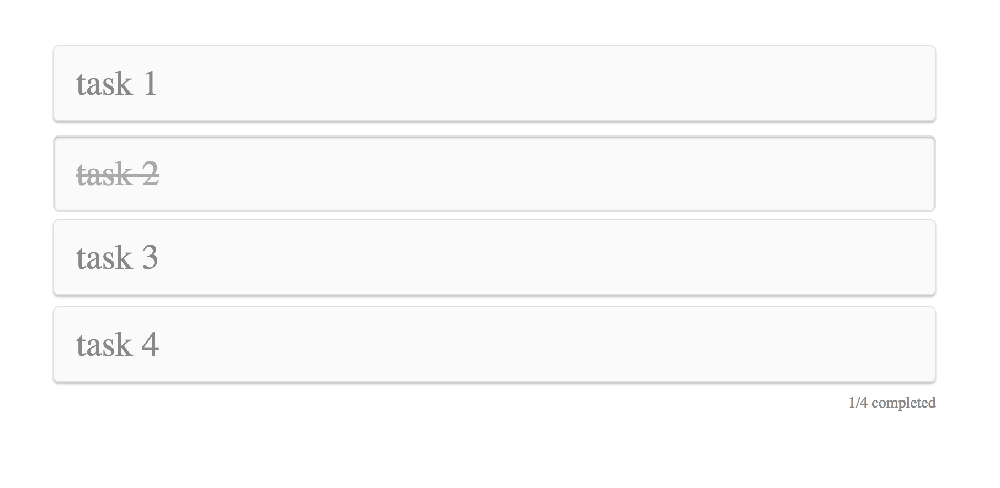

# Chapter 8: Exploring Inline Styles {#Chapter-8}

In the previous chapter, we introduced CSS Modules and uncovered some clever techniques for mitigating many common UI development issues. We've drastically improved the state of our U&I components, however, we technically haven't resolved the global nature from CSS.

If this is a concern in your application, then inline styles may be the solution. Inline styles? Really? Yes!

In November of 2014, [Christopher Chedeau](https://twitter.com/Vjeux), of Facebook, gave a talk entitled [React: CSS in JS](https://speakerdeck.com/vjeux/react-css-in-js). He examined seven problems with writing CSS at scale. Using the task of building a simple button as an example, he walked through some fairly complex approaches to solving the first five of them and leaving that last two unsolved. He then dropped a pretty big bomb, declaring that all seven problems could be solved by using inline styles defined in the local react component.

Although he stated in his slides that his goal was *not* to convince developers to drop CSS and use JS instead, that’s exactly what began to happen. The talk spurred a flurry of activity.


## What are Inline Styles

If you've been following along, you've already been introduced to inline styles. In short, it's the methodology of applying styles directly on the element with JavaScript. Why may this be useful? Here are a few quick reasons that will come to light as we progress through the next several chapters:

- **Cascade-less:** The scary "global" nature of CSS is neutered.
- **All JavaScript:**  One sense I get is that some people just like and prefer working in all JavaScript.
- **Dynamic Styles**: "State" is largely a JavaScript concern. If you want/need style to change based on dynamic conditions (states) on your site, it may make sense to handle the styling related to the state change along with everything else.


## Inline Styles in Action

Unlike before, where we needed to install additional dependencies, we already have inline styles provided to us. All that's needed is to use the `style` prop on the appropriate elements. 

I> Due to the modular nature of our components, it has been effortless to switch between these various technologies. In fact, you can have both CSS modules and inline styles work together across a U&I library.


### Configuring our Styles

Lets start with our `styles` directory, since we use these across our application.

{title=src/styles/theme.js}
```js
export default {
  $APP: 'todos-app',

  $mainBackgroundColor: '#F1F1F1',
  $mainFontFamily: 'Helvetica Neue, Arial, sans-serif',

  $lightGray: '#FAFAFA',
  $darkGray: '#888888'
}
```

This should look familiar; we've simply converted our old `theme.scss` to its JS equivalent, where variables and their values are the `key`s and `value`s in a JS object. We continue to adhere to the JS `camelCase` naming convention.

We no longer need `main.scss`, so delete the file and remove its reference inside of `index.js`. For the time being, we're going to ignore `globals.scss` as we'll apply global styles later in the chapter.


### Refactoring <App />

Lets first visit our `App` styles:

{title=src/components/App/App.styles.js}
```js
export default {
  app: {},
  todosList: {
    margin: '50px auto',
    maxWidth: 800
  },
  todosListItem: {
    margin: '10px 0'
  }
}
```

The file type is updated to JS and it's good practice to denote that the file is of a `style` type; hence, the `ModuleName.styles.js`. The styles are converted to their JS equivalents and are then exported for consumption.

{title=src/components/App/App.js}
```jsx
// dependencies
...

// local dependencies
...
import styles from './App.styles';

class App extends Component {

  constructor(...args) {
    ...
  }

  componentDidMount() {
    ...
  }

  toggleTodo = (id) => (e) => {
    ...
  };

  generateTodosListItem = (todo, id) => (
    ...
  );

  render() {
    const { todos } = this.state;
    return (
      <div style={styles.app}>
        <TodosList pStyles={styles}>
          {_.map(todos, this.generateTodosListItem)}
          <TodosListInfo todos={todos} />
        </TodosList>
      </div>
    );
  }
}

export default App;
```

Similar to the [CSS modules](#Chapter-7) chapter earlier, we import our `styles` and reference the `key` on the appropriate elements. A major difference here is that we're no longer passing CSS names down as props, but the actual styles, hence the reason we opted for the `prop` interface for passing down our styles.


### Refactoring <TodosList />

Lets start with our styles first:

{title=src/components/TodosList/TodosList.styles.js}
```js
export default {
  todosList: {
    listStyle: 'none',
    padding: '10px 15px'
  }
}
```

Styles are converted to their equivalent JS format.

{title=src/components/TodosList/TodosList.js}

```js
// dependencies
import _ from 'lodash';
import React from 'react';
import PropTypes from 'prop-types';

// local dependencies
import styles from './TodosList.styles';

const TodosList = ({ children, pStyles }) => (
  <ul style={_.assign({}, styles.todosList, pStyles.todosList)}>
    {children}
  </ul>
);

TodosList.defaultProps = {
  children: [],
  pStyles: {
    todosList: {}
  }
};

TodosList.propTypes = {
  children: PropTypes.oneOfType([
    PropTypes.array,
    PropTypes.element
  ]),
  pStyles: PropTypes.shape({
    todosList: PropTypes.object
  })
};

export default TodosList;
```

Update the dependency, merged the inner and prop styles and update the prop definitions.

I> You should apply the internal styles first and then `pStyles`, so that custom styles passed down via props take priority in the merge operation.


### Refactoring <TodosListInfo />

First, we'll update our styles file:

{title=src/components/TodosListInfo/TodosListInfo.styles.js}
```js
import theme from '../../styles/theme';

export default {
  todosListInfo: {
    color: theme.$darkGray,
    fontSize: 14,
    textAlign: 'right'
  }
}
```

Styles are converted to their JS equivalent and we reference our `theme`'s variables, as needed.

{title=src/components/TodosListInfo/TodosListInfo.js}
```jsx
// dependencies
...

// local dependencies
...
import styles from './TodosListInfo.styles';

const TodosListInfo = ({ todos }) => {
  ...
  return (
    <li style={styles.todosListInfo}>
      {completedTodosCount}/{todosCount} completed
    </li>
  );
};

...
```

We import `styles` and reference the appropriate keys.


### Refactoring <TodosListItems />

Lets start with our styles:

{title=src/components/TodosListItem/TodosListItem.styles.js}
```js
import theme from '../../styles/theme';

export default {
  todosListItem: {
    background: theme.$lightGray,
    borderRadius: 5,
    border: '1px solid #E1E1E1',
    boxShadow: '0 2px 1px 0 rgba(0, 0, 0, 0.2)',
    color: theme.$darkGray,
    cursor: 'pointer',
    fontSize: '2rem',
    padding: '15px 20px',
    position: 'relative',
    transition: 'all 0.2s ease',

    // inline styles do not support complex CSS pseudo-selectors, key frame animations, media
    // queries, etc. we will later explore how we can get this sort of functionality with useful
    // open source libraries
    
    // &:hover {
    //   opacity: 0.8
    // }
  },

  completedTodosListItem: {
    background: theme.$lightGray,
    boxShadow: 'inset 0 1px 2px 0 rgba(0, 0, 0, 0.3)',
    color: '#AAAAAA',
    textDecoration: 'line-through',
    top: 3
  }
}
```

We make the necessary changes to update our styles file, but we've commented out some of the more complex CSS properties as they are not provided with base inline styles. We will take care of making inline styles fully-functional very soon.

{title=src/components/TodosListItem/TodosListItem.js}
```jsx
// dependencies
import _ from 'lodash';
import PropTypes from 'prop-types';
import React from 'react';

// local dependencies
import styles from './TodosListItem.styles';

const TodosListItem = ({ pStyles, todo, handleClick }) => (
  <li
    style={_.assign({},
      styles.todosListItem,
      pStyles.todosListItem,
      todo.completed && styles.completedTodosListItem,
      todo.completed && pStyles.completedTodosListItem
    )}
    onClick={handleClick(todo.id)}>
    {todo.description}
  </li>
);

TodosListItem.defaultProps = {
  todo: {},
  toggleTodo: _.noop,
  pStyles: {
    todosListItem: {},
    completedTodosListItem: {}
  }
};

TodosListItem.propTypes = {
  handleClick: PropTypes.func,
  todo: PropTypes.shape({
    completed: PropTypes.boolean,
    description: PropTypes.string,
    id: PropTypes.number
  }),
  pStyles: PropTypes.shape({
    todosListItem: PropTypes.object,
    completedTodosListItem: PropTypes.object
  })
};

export default TodosListItem;
```

We import our styles and apply them appropriately to the correct elements. We continue to follow the same pattern for giving higher priority to our `pStyles`. Finally, we made sure to update our `defaultProps` and `propTypes` definitions to reflect our changes.

If you visit the app, you will find that the app is nearly on par with where we were in our previous chapters: 





There are, however, a few things to consider:

- We no longer have our global CSS styles. We could include a CSS file to apply these different styles, however, we'll opt for a better all-in-JS solution.
- With inline styles, we don't have many of the advanced CSS features, such as pseudo-selectors, media queries, key frame animations, etc. however, there are a few useful libraries that we'll later explore for this functionality.
- We no longer have the `composes` or `extends` functionality, so we merge our two different objects with either the ES6  `…`  spread operator or `assign`/`merge`.

Not bad for something provided to us out of the box. Go ahead and inspect the DOM elements. You can see all of the styles applied directly on the HTML elements, just as you'd suspect.


## Inline Styles Enhanced

Inline styles are neat, but we can't build anything substantial if we're not able to use some of the more advanced CSS features. This is why we require a better solution to help us achieve important functionalities like global styles, advanced CSS features, etc.


## What is Radium?

Meet [Radium](http://formidable.com/open-source/radium/)! A well documented and supported library, made by [Formidable Labs](https://formidable.com/open-source/), to supplement inline styles with all the desirable functionality we need. There are other libraries out there, however, Radium is robust with an active community, so we'll use it to demonstrate inline styles in all of its glory.


## Radium in Action

First, we'll need to install two dependencies:

{line-numbers=off}
```bash
$ npm i radium radium-normalize --save
```

We're using `radium-normalize` to help reset browser styles. This is the similar to what you'd see in a `reset.css` or a `normalize.css` to achieve common behavior across different browsers.

Once these dependencies are installed, adding Radium to our project is easy. We'll use a few of Radium's most popular features, but I recommend looking through their documentation to familiarize yourself with many of the other provided features.


### Configuring our Styles

Lets first update our `globals` styles file.

{title=src/styles/globals.styles.js}
```js
import v from './theme';

export default {
  '*, *:before, *:after': {
    boxSizing: 'inherit'
  },
  html: {
    boxSizing: 'border-box'
  },
  body: {
    background: v.$mainBackgroundColor,
    fontSize: 10,
    fontFamily: v.$mainFontFamily,
    margin: 0,
    padding: 0
  }
}
```

The styles were converted to their JS equivalent and we are now ready to apply these global styles.


### Refactoring <App />

Since we're applying all of our main styles inside of `App.js`, lets go ahead and start with this file.

{title=src/components/App/App.js}
```jsx
// dependencies
...
import { Style, StyleRoot } from 'radium';
import normalize from 'radium-normalize';

// local dependencies
...
import globalStyles from '../../styles/globals.styles';

class App extends Component {

  constructor(...args) {
    ...
  }

  componentDidMount() {
    ...
  }

  toggleTodo = (id) => (e) => {
    ...
  };

  generateTodosListItem = (todo, id) => (
    ...
  );

  render() {
    const { todos } = this.state;
    return (
      <StyleRoot>
        <Style rules={normalize} />
        <Style rules={globalStyles} />
        <div style={styles.app}>
          <TodosList pStyles={styles}>
            {_.map(todos, this.generateTodosListItem)}
            <TodosListInfo todos={todos} />
          </TodosList>
        </div>
      </StyleRoot>
    );
  }
}

...
```

We import `Style` and `StyleRoot` from `radium` and, of course, `radium-normalize`. `Style` allows for us to inject CSS into our app, which we'll use for our `radium-normalize`. The `StyleRoot` module wraps the entire app as a way to keep all of its state in the React `context`. If you're not familiar with React's [`context`](https://facebook.github.io/react/docs/context.html), it's how libraries like `react-redux` are able to pass data from `redux` into your app. Radium uses `context` to maintain styles state.

We wrap our entire app with `<StyleRoot>` and pass `normalize` to the first instance of `<Style>` component and our `gloablStyles` to the second instance. The `<Style>` component is what allows for us to inject CSS into our application and since we're not defining any particular scope in its props, it defaults to being global.

That's all! We now have Radium running with our app and it's already supplementing all of our inline styles.

You can already see that some of the global browser resets have been applied.


### Refactoring <TodosList />

We were not using any advanced CSS features in this component, so nothing to change other than wrap our component with `Radium`.

{title=src/components/TodosList/TodosList.js}
```js
// dependencies
...

// local dependencies
...

const TodosList = ({ children, pStyles }) => (
  <ul style={[styles.todosList, pStyles.todosList]}>
    {children}
  </ul>
);
  
...

export default Radium(TodosList);
```

The style `array` syntax is another feature that Radium provides. Instead of `merge/assign`, we can use the `array` syntax and have styles applied in the order they are defined. That's clean!

### Refactoring <TodosListInfo />

Very similar as before:

{title=src/components/TodosListInfo/TodosListInfo.js}
```js
// dependencies
...
import Radium from 'radium';

// local dependencies
...

const TodosListInfo = ({ todos }) => {
  ...
};

...

export default Radium(TodosListInfo);
```

We import Radium and wrapped our component so that it's enhanced with Radium's features.


### Refactoring <TodosListItems />

Lets start with our styles:

{title=src/components/TodosListItem/TodosListItem.styles.js}
```js
import theme from '../../styles/theme';

export default {
  todosListItem: {
    background: theme.$lightGray,
    borderRadius: 5,
    border: '1px solid #E1E1E1',
    boxShadow: '0 2px 1px 0 rgba(0, 0, 0, 0.2)',
    color: theme.$darkGray,
    cursor: 'pointer',
    fontSize: '2rem',
    padding: '15px 20px',
    position: 'relative',
    transition: 'all 0.2s ease',
    ':hover': {
      opacity: 0.8
    }
  },

  completedTodosListItem: {
    background: theme.$lightGray,
    boxShadow: 'inset 0 1px 2px 0 rgba(0, 0, 0, 0.3)',
    color: '#AAAAAA',
    textDecoration: 'line-through',
    top: 3
  }
}
```

We uncomment our code and enable `:hover` by including as a `string`.

{title=src/components/TodosListItem/TodosListItem.js}
```js
// dependencies
...
import Radium from 'radium';

// local dependencies
...

const TodosListItem = ({ pStyles, todo, handleClick }) => (
  <li
    style={[
      styles.todosListItem,
      pStyles.todosListItem,
      todo.completed && styles.completedTodosListItem,
      todo.completed && pStyles.completedTodosListItem
    ]}
    onClick={handleClick(todo.id)}>
    {todo.description}
  </li>
);

...

export default Radium(TodosListItem);
```

We require `Radium` and update our export, just like before, and continue to use the array syntax to merge our styles.

Visit your browser and you'll find that the app has all of the features you'd expect. This all worked with a few additional lines of code. This is just the beginning, I tell ya!


## Suggested Exercise

To better understand Radium and inline styles, I recommend experimenting with the following:

- Add other global styles to your app. For example, add a default `background-color` to all `div` elements within the app.
- Experiment with media queries.
- Experiment with CSS key frame animations.
- CSS preprocessors provide us many useful functions like color manipulations. How would you do this with JS? You may want to look into a small npm module: [`color`](https://github.com/brehaut/color-js).
- … and anything else you'd like, of course.


## Summary

In this chapter, we converted our entire application to consume inline styles with a few minor changes. Where do we stand in our U&I checklist?


|                                 | CSS | SCSS | CSS Modules | Inline Styles |
|---------------------------------|:---:|:----:|:-----------:|:-------------:|
| **No global namespace**         |  -  |  -   |     ✔       |      ✔       |
|---------------------------------|-----|------|-------------|---------------|
| **Unidirectional styles**       |  ✔  |  ✔  |     ✔       |      ✔       |
|---------------------------------|-----|------|-------------|---------------|
| **Dead code elimination**       |     |      |     ✔       |      ✔       |
|---------------------------------|-----|------|-------------|---------------|
| **Minification**                |     |      |     ✔       |      ✔       |
|---------------------------------|-----|------|-------------|---------------|
| **Shareable constants**         |     |      |             |      ✔        |
|---------------------------------|-----|------|-------------|---------------|
| **Deterministic resolution**    |  -  |  -   |     ✔       |      ✔       |
|---------------------------------|-----|------|-------------|---------------|
| **Isolation**                   |  -  |  -   |     ✔       |      ✔       |
|---------------------------------|-----|------|-------------|---------------|
| **Extendable**                  |  -  |  -   |     ✔       |      ✔       |
|---------------------------------|-----|------|-------------|---------------|
| **Documentable**                | NA  |  NA  |     NA      |      NA       |
|---------------------------------|-----|------|-------------|---------------|
| **Presentable**                 | NA  |  NA  |     NA      |      NA       |
|---------------------------------|-----|------|-------------|---------------|

Fulfilled ✔
Pseudo fulfilled -


Whoora! We have finally fulfilled all of our U&I specs outlined in [Chapter 2](#Chapter-2), excluding a few that we intentionally are leaving until later chapters. With inline styles, we no longer have to worry about name clashes and dependency management. We continue to provide an intuitive API for custom styles and are able to share code between our styles and templates.

In the next chapter, we're going to see how we can leverage inline styles and provide our application real-time capabilities. What does that mean? You'll soon find out...