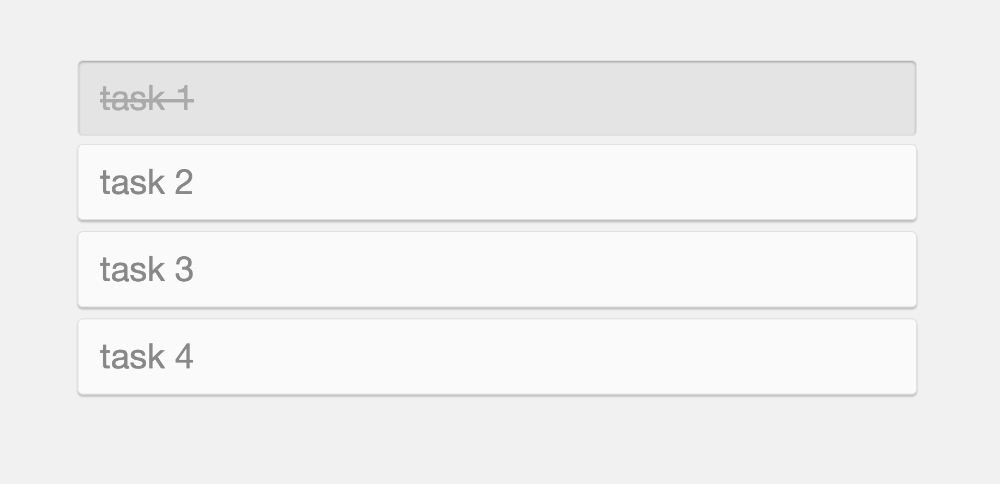
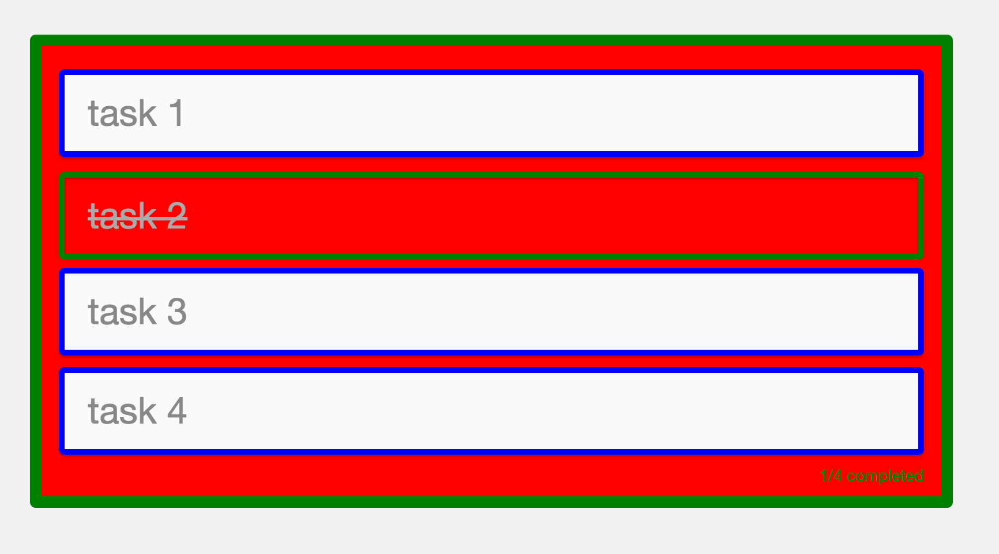
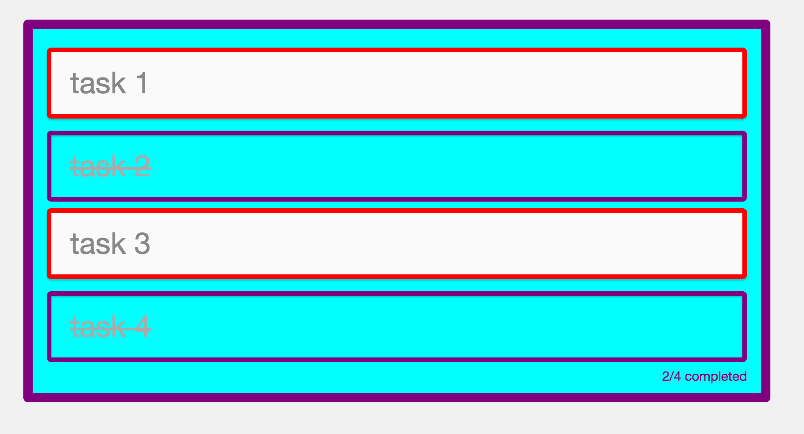

# Chapter 9: Adding Real Time Capabilities {#Chapter-9}

In the previous chapter we uncovered how we can use an old paradigm, such as inline styles, in modern applications to fulfill many of the U&I criteria outlined in [Chapter 2](#Chapter-2).

So, what are we going to do in this chapter?

In this chapter, we're going to take inline styles to an entirely new level. Say you wanted to build an app that you could swap variables, themes and styles on the fly. How would you do that with CSS, CSS preprocessors, CSS Modules, etc.? You need to rely on some clever build tools to help you achieve pseudo real-time capabilities. However, since we've doubled-downed on JS-everything, we can leverage many of its powerful qualities to add real-time behaviors.


## What is Theme Wrap?

In this chapter, we introduce [`theme-wrap`](https://github.com/FarhadG/theme-wrap), an open-source library that I built to help manage inline styles, provide theme management, offer style mixing support, and, ultimately, real-time capabilities.

You can think of `theme-wrap` like a gift wrap for your React apps. Clever, I know! :)


## Theme Wrap in Action

Start by installing the library:

{line-numbers=off, lang=text}
```
$ npm i theme-wrap --save
```

Once installed, we can start exploring all of its different functionality.


### Refactoring <App />

Let's start with the root of our components:

{title=src/components/App/App.js, lang=text}
```
// dependencies
...
import { ThemeWrapProvider } from 'theme-wrap';

// local dependencies
...
import theme from '../../styles/theme';

class App extends Component {

  constructor(...args) {
    ...
  }

  componentDidMount() {
    ...
  }

  toggleTodo = (id) => (e) => {
    .
  };

  generateTodosListItem = (todo, id) => (
    ...
  );

  render() {
    const { todos } = this.state;
    return (
      <StyleRoot>
        <Style rules={normalize} />
        <Style rules={globalStyles} />
        <ThemeWrapProvider theme={theme}>
          ...
        </ThemeWrapProvider>
      </StyleRoot>
    );
  }
}

...
```

We wrap our application with `ThemeWrapProvider` and pass our `theme` via the `theme` prop. We now have `theme` in React's `context`.


### Refactoring <TodosList />

Let's update styles:

{title=src/components/TodosList/TodosList.styles.js, lang=text}
```
export default () => ({
  todosList: {
    listStyle: 'none',
    padding: '10px 15px'
  }
});
```

We export a `function` where `theme` is provided as the first argument in our styles function *(not used here)*. Note the implicit ES6 return statement where we're returning an object with a single key, `todosList`.

{title=src/components/TodosList/TodosList.js, lang=text}
```
// dependencies
...
import { applyThemeWrap } from 'theme-wrap';

// local dependencies
...

export const TodosList = ({ children, pStyles, twStyles }) => (
  <ul style={[twStyles.todosList, pStyles.todosList]}>
    {children}
  </ul>
);

...

export default _.flow(
  Radium,
  applyThemeWrap(styles)
)(TodosList);
```

We import `applyThemeWrap` from `theme-wrap` to *enhance* our component by applying our styles with the provided `theme`. We'll also need a function composition utility to help us wrap our component with several higher order functions. If you've used `Redux`, then you've most likely used `compose`, allowing components to be wrapped with several higher order functions.  If you're not familiar with this concept, I'd highly recommend looking into the many articles explaining function currying, higher order functions, etc. It's a worthy pursuit to understand its benefits and how to use it, in addition to it being quite prevalent in React applications. That said, `flow` is lodash's utility with an added benefit that it applies the function arguments in the order as they're read, as opposed to `compose` being right to left.

We pass `styles` to `applyThemeWrap` so that we have `theme` provided to our `styles` for consumption. Secondly, we update the references to our styles to `twStyles` *(short for theme wrapped styles)* passed down via `props` by `applyThemeWrap`.

Lastly, we `export` our base component without all of the enhancements, in cases where we want to test or reference its prop definitions.

Let's do a quick recap of the necessary changes:

- Our styles `styles` become a `function` with `theme` as its first argument (if needed).
- Wrap components with `applyThemeWrap` and pass the component's `styles` as the first argument.
- Reference styles from `twStyles` passed down via `props`.
- Export the base component.


### Refactoring <TodosListInfo />

Let's start with the styles:

{title=src/components/TodosListInfo/TodosListInfo.styles.js, lang=text}
```
export default (theme) => ({
  todosListInfo: {
    color: theme.$darkGray,
    fontSize: 14,
    textAlign: 'right'
  }
});
```

Our styles become a function with `theme` provided as the first argument. We no longer need to access our `theme` directly.

{title=src/components/TodosListInfo/TodosListInfo.js, lang=text}
```
// dependencies
...
import { applyThemeWrap } from 'theme-wrap';

// local dependencies
...
import { TodosListItem } from '../TodosListItem/TodosListItem';

export const TodosListInfo = ({ todos, twStyles }) => {
  ...
  return (
    <li style={twStyles.todosListInfo}>
      {completedTodosCount}/{todosCount} completed
    </li>
  );
};

...

export default _.flow(
  Radium,
  applyThemeWrap(styles)
)(TodosListInfo);
```

Wrap the component with `applyThemeWrap` and pass in our `styles`.  Then, reference styles via `twStyles` passed down via `props`. Don't forget to `export` the base component and update how to import `TodosListItem` for prop reference.


### Refactoring <TodosListItem />

As before, it's easier to start with our `styles`:

{title=src/components/TodosListItem/TodosListItem.styles.js, lang=text}
```
export default (theme) => ({
  todosListItem: {
    background: theme.$lightGray,
    borderRadius: 5,
    border: '1px solid #E1E1E1',
    boxShadow: '0 2px 1px 0 rgba(0, 0, 0, 0.2)',
    color: theme.$darkGray,
    cursor: 'pointer',
    fontSize: '2rem',
    padding: '15px 20px',
    position: 'relative',
    transition: 'all 0.2s ease',
    ':hover': {
      opacity: 0.8
    }
  },

  completedTodosListItem: {
    background: theme.$lightGray,
    boxShadow: 'inset 0 1px 2px 0 rgba(0, 0, 0, 0.3)',
    color: '#AAAAAA',
    textDecoration: 'line-through',
    top: 3
  }
});
```

Convert styles into a function and reference `theme`, as needed.

{title=src/components/TodosListItem/TodosListItem.js, lang=text}
```
// dependencies
...
import { applyThemeWrap } from 'theme-wrap';

// local dependencies
...

export const TodosListItem = ({
  pStyles, todo, twStyles, handleClick
}) => (
  <li
    style={[
      twStyles.todosListItem,
      pStyles.todosListItem,
      todo.completed && twStyles.completedTodosListItem,
      todo.completed && pStyles.completedTodosListItem
    ]}
    onClick={handleClick(todo.id)}>
    {todo.description}
  </li>
);

...

export default _.flow(
  Radium,
  applyThemeWrap(styles)
)(TodosListItem);
```

Did you expect anything different? I hope not, because we went through the same steps as mentioned before.

Go ahead and visit your browser and ensure everything works:





Why did we make all of these changes? Here are some of the benefits to consider, which we'll leverage shortly:

- `ThemeWrapProvider` now manages our `theme`. That is, we provide our `theme` once and all of our components get access to this single source of truth.
- `ThemeWrapProvider` manages our `theme` with real-time capabilities. That is, if we update our theme variables, all of our components become aware of this change and react instantly. This can be useful if you want to build an app that allows dynamic styling, live editing, theme swapping, etc.
- Since `theme` is treated as `data`, we can follow similar patterns to how `redux` and `react-redux` treat data by exposing what is essential to connected components.

Let's start to have some fun...


## Dynamic Theme

Let's have a little bit of fun. To really drive the point home, we need to introduce a few more variables to our `theme`:

{title=src/styles/theme.js, lang=text}
```
export default {
  $APP: 'todos-app',

  $mainBackgroundColor: '#F1F1F1',
  $mainFontFamily: 'Helvetica Neue, Arial, sans-serif',

  $lightGray: '#FAFAFA',
  $darkGray: '#888888',

  $primaryColor: 'red',
  $secondaryColor: 'green',
  $tertiaryColor: 'blue',
};
```

We added three new variables to our `theme`. Feel free to get creative by adding any color palette you'd like:

{title=src/components/TodosList/TodosList.styles.js, lang=text}
```
export default (theme) => ({
  todosList: {
    listStyle: 'none',
    padding: '10px 15px',
    border: `10px solid ${theme.$secondaryColor}`,
    background: theme.$primaryColor,
    transition: 'all 0.5s ease',
    borderRadius: 5
  }
});

```

Yeah, this is not going to look very pretty :)

{title=src/components/TodosListInfo/TodosListInfo.styles.js, lang=text}
```
export default (theme) => ({
  todosListInfo: {
    color: theme.$secondaryColor,
    fontSize: 14,
    textAlign: 'right'
  }
});
```

One more…

{title=src/components/TodosListItem/TodosListItem.styles.js, lang=texts}
```
export default (theme) => ({
  todosListItem: {
    background: theme.$lightGray,
    borderRadius: 5,
    border: `5px solid ${theme.$tertiaryColor}`,
    boxShadow: '0 2px 1px 0 rgba(0, 0, 0, 0.2)',
    color: theme.$darkGray,
    cursor: 'pointer',
    fontSize: '2rem',
    padding: '15px 20px',
    position: 'relative',
    transition: 'all 0.2s ease',
    ':hover': {
      opacity: 0.8
    }
  },

  completedTodosListItem: {
    background: theme.$primaryColor,
    border: `5px solid ${theme.$secondaryColor}`,
    boxShadow: 'inset 0 1px 2px 0 rgba(0, 0, 0, 0.3)',
    color: '#AAAAAA',
    textDecoration: 'line-through',
    top: 3
  }
});
```

Visit your browser and you'll see that we've officially made our todos list a designer's worst nightmare.





Hey! You didn't pick up this book for design advice, so take it easy or feel free to build an appropriate color palette of your choice. One of my favorite resources is [Adobe Color](https://color.adobe.com/), when I need inspiration to choose a color palette.

Moving on…

Currently, when we toggle our todo items, they animate to their updated values. These values are dynamic and can be changed on the fly, so let's go ahead and see how that would work:

{title=src/components/App/App.js, lang=text}
```
// dependencies
...

// local dependencies
...

class App extends Component {

  constructor(...args) {
    super(...args);
    this.state = {
      todos: {},
      dynamicTheme: theme
    };
  }

  componentDidMount() {
    ...
  }

  randomizeTheme = () => {
    const colorPalette = [
      'red', 'green', 'blue', 'yellow',
      'orange', 'purple', 'cyan'
    ];
    const dynamicTheme = {
      ...this.state.dynamicTheme,
      $primaryColor: _.sample(colorPalette),
      $secondaryColor: _.sample(colorPalette),
      $tertiaryColor: _.sample(colorPalette)
    };
    this.setState({ dynamicTheme });
  };

  toggleTodo = (id) => (e) => {
    ...
    this.randomizeTheme();
  };

  generateTodosListItem = (todo, id) => (
    ...
  );

  render() {
    ...
  }
}

...
```

Since we update our `theme`, we start to track it inside of our component state as `dynamicTheme`. We pass this theme via our component's state to the `ThemeWrapProvider`. 

T> It's ideal to manage our `theme` inside of a state manager, like `Redux`, as a single source of truth.

We add a new function, `randomizeTheme`, that gets called every time we `toggleTodo`. This randomizer spreads over all `theme` variables and updates `$primaryColor`, `$secondaryColor` and `$tertiaryColor`.

Go ahead and check out your browser! Every time you toggle a todo, our component's react to our updated theme in real-time, without any sort of refresh. Awesome!





How is this useful? Imagine scenarios where users can change their profile by changing fonts, font sizes, entire app color schemes, etc. and we can have the entire app react accordingly, in real time, without any sort of refresh. This are the sorts of apps we can come to expect in the future.

I recommend stopping here and experimenting with different styles and elements. It can be fun and rewarding!


## Mixins

Mixins are another useful functionality provided by `theme-wrap`. These mixins are similar to what you'd get from Sass mixins, but in JS.

For example, if we had a list of lists, such as a `TodosList`, `NamesList`, etc., that had common styles, mixins provide an elegant solution for managing these common styles. Let's see how that looks:

{title=src/styles/mixins.js, lang=text}
```
import { ThemeWrapMixin } from 'theme-wrap';

export default new ThemeWrapMixin()
.set('list', (theme) => ({
  listStyle: 'none',
  padding: '10px 15px',
  borderRadius: 5
}));
```

Import `ThemeWrapMixin` from `theme-wrap` and create a new instance. There may be situations where you have many different mixin instances, so by defining individual themes and mixins, we have a good amount of flexibility. In many cases, a single instance is fine.

After creating an instance, we simply `set` our mixin by defining a unique name, e.g. `list`, and a function that is accepts `theme` as the first argument. This is the same `theme` managed by `ThemeWrapProvider`. Neat! 

As you can see, these styles resemble our `TodosList.styles.js`. That's because we want to extract these and have them shared across all list components. Finally, we export our `mixins` instance.

How do `mixins`  get consumed by `ThemeWrapProvider`? In the same way that it consumes `theme`. Let's see how we'd do that:

{src=src/components/App/App.js, lang=text}
```
// dependencies
...

// local dependencies
...
import mixins from '../../styles/mixins';

class App extends Component {

  constructor(...args) {
    ...
  }

  componentDidMount() {
    ...
  }

  randomizeTheme = () => {
    ...
  };

  toggleTodo = (id) => (e) => {
    ...
  };

  generateTodosListItem = (todo, id) => (
    ...
  );

  render() {
    const { dynamicTheme, todos } = this.state;
    return (
      <StyleRoot>
        <Style rules={normalize} />
        <Style rules={globalStyles} />
        <ThemeWrapProvider theme={dynamicTheme}
                           mixins={mixins}>
          ...
        </ThemeWrapProvider>
      </StyleRoot>
    );
  }
}

export default App;
```

Import `mixins` and pass it as a prop to  `ThemeWrapProvider`. That's it!

Now, we just need to use our mixins in our `TodosList` component:

{title=src/components/TodosList/TodosList.styles.js, lang=text}
```
export default (theme, mixins) => ({
  todosList: {
    ...mixins.get('list'),
    border: `10px solid ${theme.$secondaryColor}`,
    background: theme.$primaryColor,
    transition: 'all 0.5s ease',
  }
});
```

Our `styles` file is actually provided two values: `theme` and `mixins`. We remove any common styles and `get` them by calling the appropriate `mixins` value. The spread operator is used to merge the styles together.

Let's try another example:

{title=src/styles/mixins.js, lang=text}
```
import { ThemeWrapMixin } from 'theme-wrap';

export default new ThemeWrapMixin()
.set('list', (theme) => ({
  listStyle: 'none',
  padding: '10px 15px',
  transition: 'all 0.5s ease',
  borderRadius: 5
}))

.set('listItem', (theme) => ({
  background: theme.$lightGray,
  borderRadius: 5,
  boxShadow: '0 2px 1px 0 rgba(0, 0, 0, 0.2)',
  color: theme.$darkGray,
  cursor: 'pointer',
  fontSize: '2rem',
  padding: '15px 20px',
  position: 'relative',
  transition: 'all 0.2s ease',
  ':hover': {
    opacity: 0.8
  }
}))
```

We chain another mixin definition onto our `mixin` instance for common `listItem` styles. Let's put it to use:

{title=src/components/TodosListItem/TodosListItem.styles.js, lang=text}
```
export default (theme, mixins) => ({
  todosListItem: {
    ...mixins.get('listItem'),
    border: `5px solid ${theme.$tertiaryColor}`,
  },

  completedTodosListItem: {
    ...mixins.get('listItem'),
    background: theme.$primaryColor,
    border: `5px solid ${theme.$secondaryColor}`,
    boxShadow: 'inset 0 1px 2px 0 rgba(0, 0, 0, 0.3)',
    color: '#AAAAAA',
    textDecoration: 'line-through',
    top: 3
  }
});
```

Visit your browser and see the application in action:


There is a lot more functionality contained in `theme-wrap`. For example, you can provide multiple `ThemeWrapProvider`s in your app. That is, you can have multiple themes within your app by having different parts of your app contained under different `ThemeWrapProvider`s. You could even nest your `ThemeWrapProvider`s. Why would you want multiple themes in your app? Imagine cases in large applications, e.g. a News site, where each section of the application has different themes for the same components.


## Summary

In this chapter, we took our app to the next level by providing live-reloadable styles, powerful mixins functionality, theme encapsulation, and more…

Since we've only added functionality to our inline styles, you shouldn't be surprised that we continue to meet all of the U&I specs as before:


|                                 | CSS | SCSS | CSS Modules | Inline Styles |
|---------------------------------|:---:|:----:|:-----------:|:-------------:|
| **No global namespace**         |  *  |  *   |     ✔       |      ✔       |
|---------------------------------|-----|------|-------------|---------------|
| **Unidirectional styles**       |  ✔  |  ✔  |     ✔       |      ✔       |
|---------------------------------|-----|------|-------------|---------------|
| **Dead code elimination**       |     |      |     ✔       |      ✔       |
|---------------------------------|-----|------|-------------|---------------|
| **Minification**                |     |      |     ✔       |      ✔       |
|---------------------------------|-----|------|-------------|---------------|
| **Shareable constants**         |     |      |             |      ✔        |
|---------------------------------|-----|------|-------------|---------------|
| **Deterministic resolution**    |  *  |  *   |     ✔       |      ✔       |
|---------------------------------|-----|------|-------------|---------------|
| **Isolation**                   |  *  |  *   |     ✔       |      ✔       |
|---------------------------------|-----|------|-------------|---------------|
| **Extendable**                  |  *  |  *   |     ✔       |      ✔       |
|---------------------------------|-----|------|-------------|---------------|
| **Documentable**                | ✔   |  ✔  |     ✔       |      ✔        |
|---------------------------------|-----|------|-------------|---------------|
| **Presentable**                 | ✔  |  ✔   |     ✔       |      ✔        |
|---------------------------------|-----|------|-------------|---------------|

A> [ ✔ Fulfilled ] [ * Pseudo fulfilled ]


Before you continue to next chapters, experiment with `theme-wrap` and start thinking about different ways of leverage this sort of functionality. One thing to note is that all of this is possible due to the power and flexibility of inline styles.